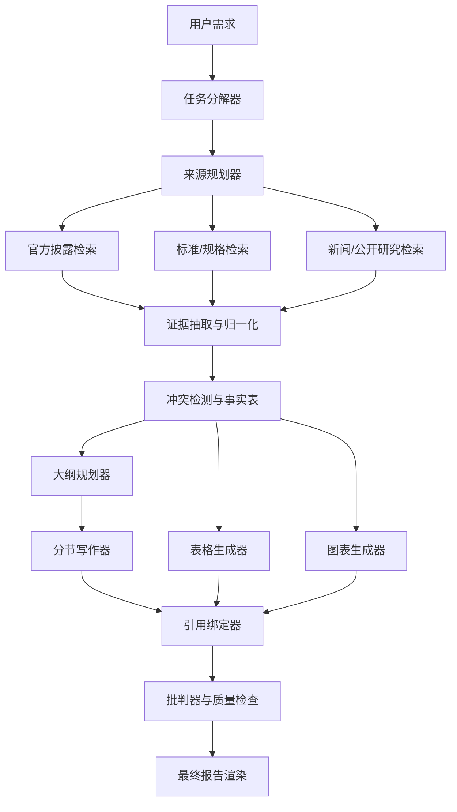
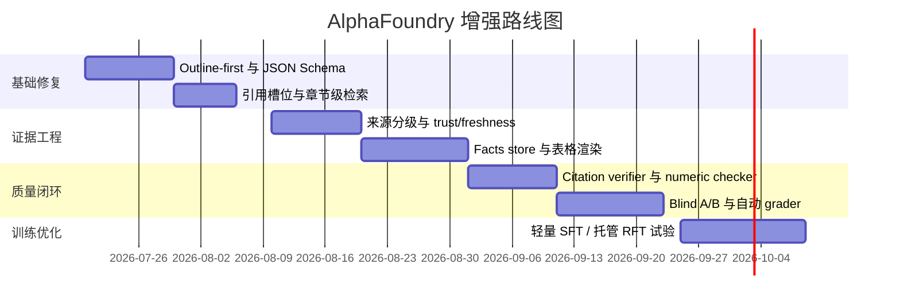
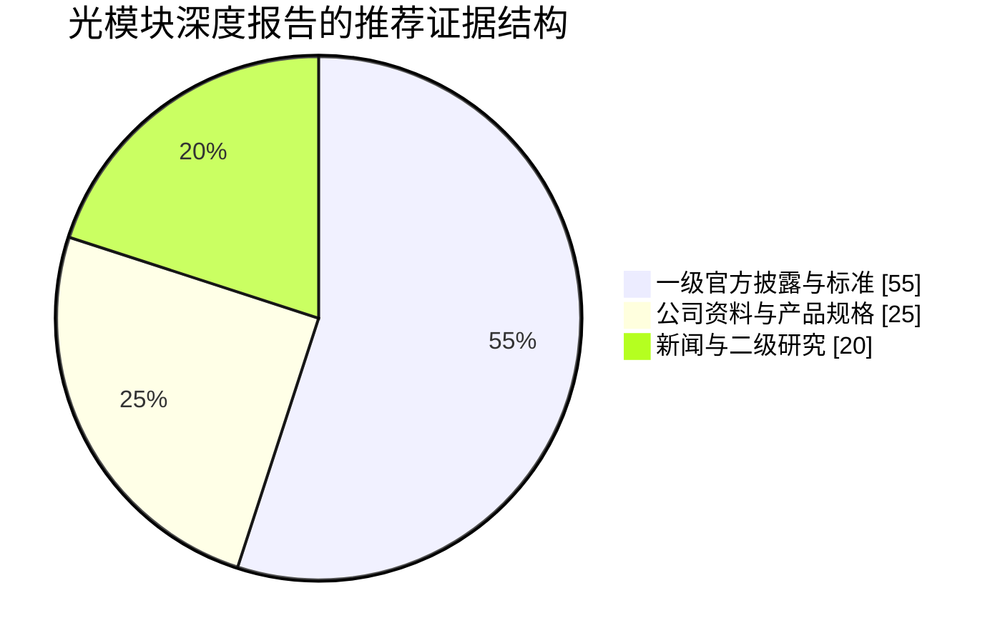

# AlphaFoundry 深度研究报告生成系统设计研究

## 执行摘要

结论先行：如果 AlphaPai、AlphaEngine 这类系统确实能持续产出比你当前 AlphaFoundry 更高质量的结构化行研报告，那么它们的优势大概率**不主要来自“模型更大”**，而来自一条更完整的“**规划—检索—抽取—大纲—写作—校验—渲染**”流水线。公开可验证的同类系统里，OpenAI Deep Research 明确披露了多步规划、回溯、网页/文件/PDF 分析、Python 作图与句段级引用能力；Gemini Deep Research 明确披露了个性化研究计划、并行/串行子任务执行、研究过程可视化以及多轮自我批判；Anthropic 面向金融行业的方案则明确强调了接入金融数据提供商和企业平台的 MCP 连接能力。这些公开能力描述，与 STORM、RAPID、FoRAG、CRAG、RAPTOR 等研究论文中的长文生成和检索增强架构高度一致。citeturn6view0turn6view2turn6view3turn6view5turn27academia0turn25academia0turn25academia1turn8academia2turn8academia0

对 AlphaFoundry 而言，在**只有 API 访问、没有 GPU** 的前提下，最有性价比的路径不是先做微调，而是先把系统改造成“**证据优先**”而不是“**模板优先**”。实操上，最值得优先建设的是：混合检索、来源分级、事实抽取与归一化、JSON Schema 约束的大纲与表格生成、句级引用绑定、以及自动评测闭环。原因是这几层能力已经可以完全依赖托管 API 来实现：例如 OpenAI 已提供托管式 file search / vector store、结构化输出、函数调用，以及 prompt caching、Batch API、Flex processing 等成本优化能力；这些能力本身就足以支撑一个多阶段 research compiler，而不需要自建推理集群。citeturn21view0turn21view2turn21view3turn30view1turn30view3turn24view0turn24view2turn23view3

从研发优先级看，我的建议是：先用 **两到三周** 把 AlphaFoundry 从“单次长文生成”升级为“**outline-first + evidence-first**”；再用 **四到六周** 做来源分级、事实表与引用校验；最后用 **八到十二周** 引入 critic、自评/他评、A/B 实验与可选的托管式微调。按照这个路径，通常可以在不训练模型的前提下，先拿到最关键的质量跃迁：结构逻辑更稳、数据表可复核、引用更可信、编辑成本明显下降。STORM 显示，围绕“预写作阶段”的多视角研究与大纲构建，能显著提升长文的组织性与覆盖度；RAPID 与 FoRAG 进一步说明，**先大纲后写作**和**基于检索的事实优化**对复杂长文非常关键。citeturn27academia0turn25academia0turn25academia1

你已经上传了一个“光模块”研究报告样稿作为问题背景。把这类样稿从“较强模板感、证据链松散、段落生成”升级为“研究编译器产物”，是完全可做的，而且很适合从光模块这种**高技术密度、强规格约束、强上市公司披露依赖**的赛道开始打样。fileciteturn0file0

## 研究边界与关键假设

这份报告对 AlphaPai 和 AlphaEngine 的判断，采用的是“**公开可验证能力 + 同类系统官方描述 + 相关论文**”的推断框架，而不是内部技术披露。原因很简单：我在本次检索中没有拿到它们可直接验证的内部架构文档，所以以下分析把它们视为“**深度研究/长文行研生成系统**”的同类产品来研究。为避免误导，我把判断分成三层：**直接证据**、**高概率推断**、**工程建议**。OpenAI 与 Google 官方材料属于直接证据；STORM、RAPID、FoRAG、CRAG、RAPTOR、Self-RAG 等论文属于“机制层面的高概率证据”；AlphaFoundry 的路线图则是结合你当前约束做出的工程建议。citeturn6view0turn6view2turn6view3turn27academia0turn25academia0turn25academia1turn8academia2turn8academia0turn17academia2

我在以下方面做了明确假设。第一，你可以稳定调用一家或多家大模型 API，并能在服务端保存文件、元数据、向量索引和异步任务状态。第二，你的目标输出不是“聊天回答”，而是**五到二十页**的中文结构化行研报告，典型主题类似光模块、零部件、半导体设备、供应链、竞品与市场格局。第三，你可以接入公开网络，且在合规前提下拉取官方财报、公告、规格文档、专利、标准组织资料、公司官网与权威新闻。第四，你没有 GPU，因此不把“自训 embedding / reranker / reward model”作为主路径，而优先使用托管向量检索、结构化输出、工具调用、批处理和弹性处理。OpenAI 官方文档已明确提供 embeddings、file search、vector stores、structured outputs、function calling、Batch API、Flex processing 和 prompt caching；Gemini 和 Anthropic 的官方材料也明确展示了“研究 + 连接器/私有数据”的产品方向。citeturn21view0turn21view2turn21view3turn30view1turn30view3turn24view0turn24view2turn23view3turn6view2turn6view5

**高概率判断**可以概括为一句话：这类系统真正的难点，不是“写出一段更像分析师的中文”，而是“让每个结论都有足够好的证据输入、足够好的结构约束、以及足够好的事后校验”。Google 官方已经明确写到 Deep Research 会把问题分解成更小子任务，并根据依赖关系决定哪些任务并行、哪些串行，还会做多轮自我批判以增强清晰度与细节；OpenAI 官方则明确写到 Deep Research 是用端到端强化学习训练出来的多步浏览与推理代理，会回溯并根据实时信息调整动作。这些都说明：**好报告是被“编译”出来的，而不是被一次性“写”出来的**。citeturn6view0turn6view3

## 同类系统的可能架构

下面这张表，把可行架构按“复杂度—质量—成本”做了聚类。为了直观起见，我把你当前 AlphaFoundry 很可能所在的位置也标出来了。

| 架构模式 | 核心机制 | 公开证据或研究原型 | 优点 | 局限 | 相对成本 | 预期质量 |
|---|---|---|---|---|---|---|
| 单轮模板生成 | 一个 prompt + 固定章节模板 + 少量检索 | 更像很多早期“AI 写报告”产品；你当前描述的 AlphaFoundry 大概率接近这一档 | 上线快、实现简单 | 模板感强、段落空泛、引用易失真、表格难复核 | 低 | 低到中 |
| 大纲优先 RAG | 先生成 outline，再按节检索和写作 | STORM、RAPID、FoRAG citeturn27academia0turn25academia0turn25academia1 | 结构显著改善，便于分节控长 | 仍可能受检索质量影响 | 中 | 中到高 |
| Agentic deep research | 任务分解、并行/串行子任务、持续检索、critic 回扫 | OpenAI Deep Research、Gemini Deep Research、Anthropic 金融连接器 citeturn6view0turn6view2turn6view3turn6view5 | 适合复杂主题，能综合多源、自动扩展证据 | 延迟更高，系统/观测复杂度更高 | 中到高 | 高 |
| 证据图谱式 report compiler | 检索之外再做事实抽取、实体归一、表格与引用绑定、渲染分离 | CRAG、RAPTOR、LongCite、Structured Outputs / Function Calling citeturn8academia2turn8academia0turn28academia2turn30view1turn30view3 | 最适合严肃行研，数字可复核，引用精细 | 初期工程量最大 | 高 | 很高 |

如果要回答“AlphaPai/AlphaEngine **可能**在用什么”，我的判断是：**高概率位于第三档，优秀版本会向第四档演进**。这类系统通常会同时具备以下机制：一是**任务级 agent**，负责把需求拆成若干 research question；二是**检索级 RAG**，把网页、PDF、公告、财报、规格与专利接入同一检索层；三是**写作级 outline-first pipeline**，先做逻辑框架再做章节写作；四是**质量级 critic/eval loop**，在写后对引用缺失、数字矛盾、结构跳跃做二次回扫。STORM 的核心贡献就在于把“预写作阶段”显式化；RAPID 把它进一步推进到“检索增强的大纲生成 + 计划驱动写作”；FoRAG 则强调同时优化**事实性**和**逻辑清晰度**。citeturn27academia0turn25academia0turn25academia1

更具体一点说，我认为这类系统不太可能只做“向量检索 + 大模型生成”。原因在于纯平铺式检索很难处理长文报告里最关键的几个问题：多来源冲突、同一指标多口径、文档太长、章节之间的逻辑依赖。RAPTOR 通过层级摘要树来改善长文检索；CRAG 引入检索质量评估器，在静态语料不足时回退到更大范围搜索；Self-RAG 则证明“检索—生成—反思”一体化可以提升事实性与引用质量。这些机制都非常像高质量报告系统在生产上会采用的“轻量代理化”做法。citeturn8academia0turn8academia2turn17academia2

最后，关于“是否用了 fine-tuning”，我的判断是：**很可能有，但不是第一性优势来源**。如果目标是稳定的报告风格、标题层级、风险提示格式、表格字段命名，那么托管式 SFT 是有帮助的；如果目标是把“引用充分、数字正确、结构清晰”这些质量要求写进训练目标，托管式 RFT 也有吸引力，因为它允许用自定义 grader 定义奖励信号。但官方文档同时也说明，SFT 的收益通常可以从几十个高质量示例开始验证，RFT 则依赖你是否已经拥有清晰可靠的 grader。因此在工程排序上，我建议把 fine-tuning 放到“检索、结构、校验都稳定之后”。citeturn35view1turn35view2turn35view3

## 数据源与 ETL

真正能把“光模块报告”从普通内容生成提升到分析师级别的，不是多写几个漂亮句子，而是**数据源分层**。下面这张表是我建议你采用的来源分级。

| 来源层级 | 典型来源 | 主要用途 | 是否可直接用于数字表 | 优先级 |
|---|---|---|---|---|
| 一级官方源 | 交易所公告、监管申报、公司财报/XBRL、国家统计、标准组织、MSA/规格、专利官方库、公司官网 datasheet | 核心结论、时间点、财务数字、产品规格、标准路线 | 可以 | 最高 |
| 准一级源 | 公司业绩会纪要、公司技术白皮书、官方博客、会议论文、标准解读 webinar | 行业解释、技术背景、路线讨论 | 需要复核 | 高 |
| 二级可信源 | 权威媒体、券商/研究机构公开摘要、行业协会材料 | 补上下文、补时间线、补市场叙事 | 仅在追溯到一级源后使用 | 中 |
| 商业授权源 | 商业数据库、商业行业报告、商业新闻 feed、供应链/价格 feed | 历史序列、对比口径、加速召回 | 视授权和可追溯性而定 | 中到高 |

之所以这样分层，是因为真正的深度研究系统，首先要优化的是“**证据可信度**”，其次才是“召回范围”。美国 SEC 的 EDGAR 既提供免费公开检索，也提供 `data.sec.gov` 的 JSON/XBRL 接口，支持 company submissions 与 companyfacts，并有 nightly bulk ZIP；巨潮资讯网是深交所法定信息披露平台，同时提供数据平台和数据 API；上交所与深交所都持续发布上市公司公告；国家统计局持续发布官方统计资料；WIPO 提供 PATENTSCOPE；OSFP MSA 与 OIF 分别提供光模块规格与互操作相关资料。这些来源为光模块/光互连类报告提供了**财务、技术、标准、互操作**四条最关键的证据主线。citeturn11view0turn12view1turn12view2turn14view0turn14view1turn14view2turn14view3turn11view2turn38view1turn38view2

对光模块这个垂直主题，建议你把数据源进一步拆成六类。第一类是**监管与上市公司披露**，用于收入、毛利、资本开支、客户结构、募投项目、产能与订单。第二类是**产品规格与标准组织**，用于 form factor、lane 数、速率、互操作、管理接口与演进路线。OSFP MSA 明确写到 OSFP 支持 400G、800G、1.6T，而 OSFP-XD 支持更高密度；OIF 当前工作则直接覆盖 1600ZR、800G coherent、224G CEI 与 CMIS 5.3，这些都与未来光模块报告的“技术路线”章节高度相关。第三类是**专利与论文**，用于跟踪封装、DSP、相干、热设计与材料工艺。第四类是**公司官网与 datasheet**，用于规格、功耗、距离、兼容性。第五类是**新闻与行业解读**，用于时间线和事件触发。第六类才是**商业数据库**，用于加速和补齐历史序列。citeturn38view1turn38view2turn11view2

在 ETL 上，建议你不要只做“文档切块”。高质量行研系统更像是一个**证据标准化工厂**。我建议最少做五层标准化。第一层是**文档标准化**：HTML、PDF、财报、公告、表格、图片说明统一转成带 section path 的 text/table block。第二层是**实体标准化**：公司名、股票代码、子公司名、品牌名、别名、中文/英文名归并到统一 `entity_id`。第三层是**数值标准化**：单位统一，如亿元/百万元、Gbps/Tbps、km/m、毛利率百分点、YoY/QoQ 周期、币种。第四层是**证据标准化**：任何可生成结论的最小证据单元都保存为 `fact record + provenance`，而不是只保留原始 chunk。第五层是**信任与新鲜度评分**：来源层级、发布时间、文档类型、是否官方、是否原始数字源、是否存在交叉验证，最后汇总成 `trust_score` 与 `freshness_score`。SEC 与 OpenAI 的托管检索能力说明都表明，检索层至少应同时支持**关键词语义混合召回 + 元数据过滤**。citeturn12view2turn21view0turn21view3

为了让检索真正服务报告，不建议把二级研究和新闻直接塞给 writer。更稳妥的做法是设定一条固定优先级：**内部/上传文件 > 一级官方源 > 准一级源 > 二级可信源 > 商业授权摘要**。其中，任何会进入表格、图表或摘要结论页的数字，必须先落到“已归一化的事实表”上，再由表格/图表渲染器去消费，绝不允许 writer 从长文本里“边看边编表”。LongCite 把句级引文问题当作单独任务来做，OpenAI 也明确提到 Deep Research 能引用具体句段；这两个信号都在告诉我们，高质量系统会把“生成”和“引用绑定”拆开。citeturn28academia2turn6view0

## AlphaFoundry 的落地设计

我对 AlphaFoundry 的首选设计，不是一个“更聪明的主模型”，而是一个**多技能的报告编译器**。它的骨架应当像下面这样。



这个设计的理论基础并不神秘。OpenAI 和 Gemini 的官方产品都已经把“规划、搜索、推理、报告”拆成了显式阶段；STORM、RAPID、FoRAG 证明了大纲前置与计划驱动写作对长文结构的价值；CRAG、RAPTOR 和 Self-RAG 说明，对复杂长文，检索本身也必须带有**质量评估、层级摘要和自反思**。因此，AlphaFoundry 的关键不是“要不要做 agent”，而是“**哪些环节必须 agent 化，哪些环节必须结构化**”。我的建议是：研究规划与章节写作可以 agent 化；事实抽取、表格生成、引用绑定、质量检查则必须尽量结构化。citeturn6view0turn6view3turn27academia0turn25academia0turn25academia1turn8academia2turn8academia0turn17academia2

下面这张表，是我建议的技能拆分。

| 技能/Agent | 输入 | 输出 | 推荐模型强度 | 关键约束 |
|---|---|---|---|---|
| 任务分解器 | 用户需求、行业模板、历史项目上下文 | research questions、证据需求表、检索预算 | 中 | 必须输出 JSON |
| 来源规划器 | research questions | 来源优先级、检索域、时窗、关键词/别名 | 中 | 必须显式 source tier |
| 检索器 | 查询、过滤条件 | 文档块、表格块、证据候选 | 轻到中 | 混合检索、元数据过滤 |
| 证据抽取器 | chunk/table | normalized facts、claim-evidence pairs | 中 | 严格 schema、保留 provenance |
| 大纲规划器 | 证据摘要、报告类型 | 标题树、章节目标、各章证据覆盖要求 | 强 | outline 优先于 prose |
| 分节写作器 | 章节 brief、证据集 | 章节正文、待绑定引用槽 | 强 | 禁止输出未支撑数字 |
| 表格生成器 | normalized facts | markdown/html/json tables | 中 | 每个 cell 都要有 evidence id |
| 图表生成器 | facts table | chart spec 或 mermaid | 中 | 图值必须来自事实表 |
| 引用绑定器 | 正文、evidence ids | 句级/段级 citations | 中 | 引用最小粒度可验证 |
| 批判器 | 初稿全文、facts、citations | 缺证列表、冲突列表、重写建议 | 强 | 优先抓数字与逻辑跳跃 |

如果你只能先做最少集合，我建议先做这四个：**大纲规划器、检索器、证据抽取器、引用绑定器**。这四个做好了，报告质量会比“一个强模型 + 很长 prompt”高很多。

在 Prompt 设计上，我建议你把**大纲、事实、正文**分成三种不同的 schema，而不是共用一个万能 prompt。OpenAI 的 structured outputs 与 function calling 都支持严格 JSON Schema，这非常适合报告流水线。citeturn30view1turn30view3

**示例一：大纲规划器 Prompt 结构**

```yaml
system: |
  你是资深行业研究总编，不直接写长文，先负责编排结构。
  你的目标是：
  1) 只根据给定证据规划标题树；
  2) 每一节必须说明“要回答的问题”“要用到的证据类型”“风险与反证”；
  3) 禁止输出正文段落。
user: |
  任务: 生成《光模块行业研究报告》的大纲
  受众: 投资/战略/产品团队
  语言: 中文
  证据摘要: {{evidence_digest}}
  输出 JSON Schema:
  {
    "report_title": "string",
    "thesis": "string",
    "sections": [
      {
        "title": "string",
        "goal": "string",
        "must_answer": ["string"],
        "required_evidence_types": ["filing","datasheet","standard","news","patent"],
        "counterpoints": ["string"],
        "subsections": [{"title":"string","goal":"string"}]
      }
    ]
  }
```

**示例二：证据抽取器 Prompt 结构**

```yaml
system: |
  你是事实抽取器。你只做规范化，不做评论。
  如果文档里没有明确数字或结论，不要补全。
user: |
  文档块: {{chunk_text}}
  文档元数据: {{metadata}}
  输出 JSON Schema:
  {
    "claims": [
      {
        "claim_text": "string",
        "claim_type": "metric|event|spec|guidance|risk",
        "entities": ["string"],
        "period": "string|null",
        "value": "number|null",
        "unit": "string|null",
        "evidence_span": "string",
        "confidence": 0.0
      }
    ]
  }
```

检索策略方面，我建议你采用“**主题级—文档级—段落级—事实级**”四层索引，而不是只有 chunk embedding。一方面，RAPTOR 说明层级检索对长文理解更有帮助；另一方面，光模块这类报告往往需要跨文档合并事实，最终消费的其实不是 chunk，而是**事实记录**。因此最实用的检索方式通常是：先用主题级摘要做 coarse retrieval，再进入文档/section，再落到事实与表格单元。若 top-k 结果的 `trust_score` 和 `coverage_score` 不够，再触发 CRAG 式的“扩展搜索”或重写查询。citeturn8academia0turn8academia2

我建议的检索索引 schema 如下：

```json
{
  "doc_id": "string",
  "chunk_id": "string",
  "source_type": "filing|exchange_notice|datasheet|standard|patent|news|research|internal",
  "source_tier": "A|B|C|D",
  "source_name": "string",
  "publisher": "string",
  "language": "zh|en",
  "jurisdiction": "CN|US|EU|Global",
  "published_at": "YYYY-MM-DD",
  "effective_at": "YYYY-MM-DD|null",
  "entity_ids": ["string"],
  "entity_aliases": ["string"],
  "ticker": ["string"],
  "topics": ["800G", "1.6T", "AIDC", "DCI", "CMIS", "Coherent"],
  "section_path": ["chapter", "section", "subsection"],
  "chunk_text": "string",
  "chunk_summary": "string",
  "table_json": {},
  "facts": [
    {
      "metric": "string",
      "value": 0,
      "unit": "string",
      "period": "string",
      "scope": "string",
      "evidence_span": "string"
    }
  ],
  "trust_score": 0.0,
  "freshness_score": 0.0,
  "citation_anchor": {
    "locator": "page/paragraph/line/span"
  }
}
```

关于 fine-tuning，我的建议很明确。**先不做，或只做很轻量的格式/风格 SFT；等评测框架稳定后，再考虑托管式 RFT**。原因是 OpenAI 官方写得很清楚：SFT 往往从 50 个高质量示例就可以开始验证效果；RFT 的核心在于自定义 grader，它本质上把你关心的质量指标写成奖励函数。如果你还没有稳定的 citation checker、numeric checker、structure grader，那么先做 RFT 往往会“训出一个会取悦脆弱 grader 的模型”，而不是更好的报告系统。citeturn35view1turn35view2turn35view3

## 评估方法与实验设计

如果你想真正超过“AlphaPai/AlphaEngine 一类系统”，评估体系必须从“主观好不好看”升级为“**可量化的成品质量 + 可量化的生产效率**”。学术上，ARES 适合评估 RAG 的 context relevance、answer faithfulness 和 answer relevance；FActScore 适合把长文拆成原子事实，计算被可靠来源支持的比例；SAFE 则是 Google DeepMind 提出的 search-augmented factuality evaluator，专门面向长文事实核验；LongCite 提供了句级引用任务的直接参照；Self-RAG 则说明，自反思机制能改善事实性与引用质量。citeturn17academia0turn18academia2turn18academia0turn28academia2turn17academia2

我建议你把评测指标分成五组：

| 指标组 | 核心指标 | 解释 | 建议 KPI |
|---|---|---|---|
| 检索质量 | source-tier coverage、context relevance、evidence diversity | 是否优先召回一级源，是否覆盖关键子问题 | 一级/准一级源占比 ≥ 70% |
| 事实质量 | claim support rate、FActScore、SAFE-style supported fact ratio | 事实是否可被可靠来源验证 | 支撑率 ≥ 90% |
| 引用品质 | citation coverage、citation precision、orphan citation rate | 句子是否有引文，引文是否真支撑句子 | 句级覆盖 ≥ 85%，精度 ≥ 95% |
| 报告质量 | structure score、coherence、counterpoint coverage、table accuracy | 结构是否清晰，是否出现反证，表格数字是否一致 | 盲评胜率 ≥ 65% |
| 生产效率 | latency、cost/report、analyst edit time、redo rate | 生成速度、成本、人工改稿强度 | 编辑时长下降 ≥ 40% |

具体实验设计上，我建议你用**盲测 + 分层采样 + 在线留存数据**三层并行。最小可行方案是构造 60 个任务集：20 个光模块/连接器主题、20 个半导体或零部件主题、20 个竞品/市场格局主题。每个任务同时跑 A 与 B 两个系统版本，隐藏模型和版本信息，由产品、研究、技术三类评审各自打分。评审表不只打“更喜欢哪个”，而要分别给出：结构清晰度、事实可信度、引文可验性、数字表可靠性、可用性。自动评测层则跑 claim extraction + citation verifier + numeric checker + style schema checker。对最终上线版本，再补充一个业务 KPI：**分析师从生成稿到可发版稿的编辑用时**。这通常比单次主观偏好更接近真实收益。ARES、SAFE 和 FActScore 都在强调一点：复杂长文不能只用一个总分，要拆到 retrieval、support、relevance 和 atomic fact 级别。citeturn17academia0turn18academia0turn18academia2

我最推荐的五个实验如下。第一，**single-pass vs outline-first**，验证结构与可编辑性。第二，**平铺检索 vs 层级检索 + 查询改写**，验证召回与长文覆盖。第三，**段级引用 vs 句级引用**，验证可信度与审阅速度。第四，**由 writer 直接写表格 vs 由 facts store 渲染表格**，验证数字准确率。第五，**无 critic vs 带 critic/revision pass**，验证最终成品的一致性。按照 STORM、CRAG、Self-RAG 与 LongCite 的方向判断，这五个实验几乎一定能跑出显著差异。citeturn27academia0turn8academia2turn17academia2turn28academia2

上线前的检查表，我建议至少包含以下内容：

| 检查项 | 通过标准 |
|---|---|
| 核心结论是否都有 evidence id | 是 |
| 所有数字表格是否能回溯到来源与期间 | 是 |
| 是否出现“来源说 A，正文写 B”的冲突 | 否 |
| 是否明确说明口径差异与不确定性 | 是 |
| 一级/准一级来源占比是否达到阈值 | 是 |
| 是否存在无效链接、空引用、孤立引用 | 否 |
| 图表值是否完全来自事实表 | 是 |
| 是否覆盖风险与反证，而非只写利多叙事 | 是 |

## 成本、时间线、风险与路线图

先说资源和成本判断：在你当前的约束下，**没有 GPU 不是硬伤**，因为最关键的系统能力基本都可以由托管 API 承担。OpenAI 的 file search / vector store、结构化输出、函数调用已经覆盖了“检索 + schema + 工具接入”的骨架；成本上则可以依赖 prompt caching、Batch API 和 Flex processing 做削峰。Batch API 官方明确写了异步批处理可带来 **50% 的成本折扣**，Flex processing 官方明确写了以更慢响应换取更低成本，而 prompt caching 则对长前缀、重复系统提示和固定规则尤其有效。对于报告系统来说，这意味着事实抽取、离线评测、embedding、大纲批量生成和历史文档更新都可以走低成本路径；只有最终成稿和 critic pass 保持标准处理即可。citeturn24view0turn24view1turn23view3turn24view2

下面这张表，是我建议的分阶段投入。

| 阶段 | 时间 | 人力配置 | 主要交付 | 粗略成本感受 | 预期质量提升 |
|---|---|---|---|---|---|
| 基础修复期 | 两到三周 | 1 后端 + 1 前端/全栈 + 0.5 产品 | outline-first、JSON schema、章节级检索、引用槽位 | 低 | 结构质量明显提升 |
| 证据工程期 | 四到六周 | 2 后端/数据工程 + 0.5 产品 + 0.5 研究分析 | 来源分级、facts store、表格渲染、引用绑定 | 中 | 数据表与信任感跃迁 |
| 质量闭环期 | 六到十周 | 2 工程 + 0.5 研究分析 + 0.5 QA | critic、自评/他评、自动 grader、A/B 平台 | 中到高 | 可持续迭代，盲评显著变优 |
| 优化与训练期 | 十到十二周后 | 视预算追加 1 ML/平台工程 | 轻量 SFT / 托管式 RFT、个性化模板库 | 中到高 | 风格稳定性与特定任务提升 |

下面这个时间线，更适合作为你内部排期的第一版。



关于风险，我建议你重点盯四类。第一类是**来源偏差迁移**。STORM 在论文里明确指出，长文系统会把来源偏差和不相关事实的错误联想带进文章。第二类是**检索错误扩散**。CRAG 讨论的就是“检索一旦出错，RAG 会把错一路传到生成端”。第三类是**长文事实性下降**。FActScore 与 SAFE 都在强调，长文不是越长越好，而是越长越需要原子事实核验。第四类是**引用伪正确**：看起来有引用，但引用并不真正支撑句子。这正是 LongCite 试图解决的问题。citeturn27academia0turn8academia2turn18academia2turn18academia0turn28academia2

因此，我给你的优先级建议非常明确：

1. **立即做**：outline-first、结构化输出、句子引文槽位、来源分级。  
2. **尽快做**：facts store、表格/图表与正文解耦、numeric checker。  
3. **随后做**：critic pass、A/B 盲评平台、自动 grader。  
4. **最后做**：托管式微调与更复杂的个性化风格适配。  

如果只能押一个方向，我建议你押“**证据层**”，不是“写作层”。

## 示例输出

下面给你一个适合 AlphaFoundry 实现的“光模块报告”短版提纲示例。这个提纲不是为了显示文采，而是为了体现“结论—证据—反证—图表”四位一体的结构。

**示例提纲**

| 章节 | 目标 | 必要证据 |
|---|---|---|
| 摘要与核心判断 | 用一页讲清赛道结论、假设和风险 | 一级披露、规格/标准、近六个月事件 |
| 行业定义与产品分层 | 区分 SR/DR/LR/相干、400G/800G/1.6T、AIDC/DCI 场景 | 规格文档、标准组织、公司 datasheet |
| 需求侧 | 解释训练集群、交换芯片升级、互连带宽、资本开支如何传导到模块需求 | 云厂商/交换机/财报披露 |
| 供给侧与竞争格局 | 产能、封装能力、DSP/EML/硅光路线、客户结构 | 公司公告、招股书、年报 |
| 技术路线 | OSFP、CMIS、224G/448G 电口、相干 800G/1600G | OIF、OSFP MSA、白皮书 |
| 关键风险 | 技术切换、价格下压、客户集中、标准演进不及预期 | 反证材料、历史案例 |
| 结论 | 明确结论边界与不确定性 | 全部章节的交叉验证结果 |

下面给你一个**带引用的示例段落**。它不是在判断真实市场规模，而是在展示“研究型写法”应该如何组织证据。

> 在光模块主题上，AlphaFoundry 不应让模型直接从网页摘要“写行业判断”，而应先把**监管披露、规格标准与公司资料**拆成可检索证据层。原因是这三类来源分别承担不同角色：SEC 的 EDGAR 既支持公开检索，也提供实时更新的 submissions 与 companyfacts/XBRL 接口，适合承接财务与申报口径；巨潮资讯网则是深交所法定信息披露平台，并且提供数据平台/API，适合承接中国上市公司公告、问询与定期报告；而光模块技术路线本身又强依赖规格组织与互操作文档，OSFP MSA 明确覆盖 400G、800G、1.6T 与更高密度形态，OIF 当前工作也直接覆盖 1600ZR、800G coherent、224G CEI 与 CMIS 等关键主题。换句话说，高质量“光模块报告”本质上是把**财务口径、技术规格与时间线事件**先编译成事实表，再由写作器按章节生成可审阅文本，而不是一次性生成一篇看似完整但难以复核的长文。citeturn12view1turn12view2turn14view0turn38view1turn38view2

下面这个图不是市场份额图，而是我建议的**高质量光模块深度报告证据配比示意图**。它可以直接由 facts store 自动渲染。



如果把这份报告压缩成一句实施建议，那就是：

**先把 AlphaFoundry 从“写报告的模型”改成“编译报告的系统”，你就已经走在超过同类产品的正确方向上了。**