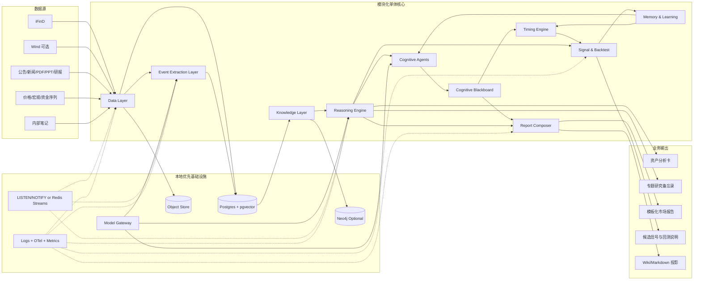

# Research Workbench 重构设计

**项目名称**: Research Workbench
**日期**: 2026-05-03
**依据**: `/Users/leon/Downloads/deep-research-report.md`
**定位**: 本地优先、可企业化的 AI-native Investment Operating System
**原则**: 模块化单体、统一数据契约、可审计事实层、可替换基础设施

---

## 1. 重构结论

Research Workbench 是面向基金研究员和量化研究员工作流的 AI-native Investment Operating System。它不再沿用“由 LLM 维护 Markdown 的知识库”作为产品定义，也不把量化理解为预测 K 线，而是以结构化事实层、事件数据库、时间化产业链图谱、情景推理层、模板写作层、择时层、记忆学习层和量化验证层为核心。

核心判断如下：

- Markdown/Wiki 降级为人类可读的投影层，不再承担唯一真相层。
- PostgreSQL + pgvector 升级为 canonical fact/event/assertion store。
- 原始资料、结构化断言、事件、情景、报告段落、推理 trace、候选信号都成为一等对象。
- AI 负责理解世界，Timing 负责交易节奏，Quant 负责验证世界；任何事件型信号都必须经过市场状态判断和 event study、超额收益、胜率、衰减、风险约束。
- 系统最终形态是 World Model + Agent Swarm，但 Agent 只是认知插件层，必须通过统一 schema 写入共享黑板。
- 不追求静态最终架构，而追求 Evolutionary Architecture：用市场反馈更新记忆、修正失败原因、提高 alpha 验证速度。
- 系统首要输出是资产分析卡、专题研究备忘录、多情景市场分析报告、候选信号与回测说明。
- MVP 采用本地优先的模块化单体，不急于拆微服务。
- 数据源、模型后端、向量库、图数据库、回测引擎均通过接口隔离，后续可替换。

本次重构不以兼容当前代码结构为目标。现有脚本、爬虫、Wiki 页面、RAG 组件可作为迁移素材，但不得反向决定新系统架构。

---

## 2. 产品目标

系统面向基金研究员和投研团队，解决四类任务：

1. **资产分析卡**
   - 对股票、ETF、指数、商品、外汇、债券、基金等资产形成标准化快照。
   - 覆盖财务、资金、量价、估值、股东、产业、事件、宏观八大维度。

2. **专题研究备忘录**
   - 围绕产业链、政策变化、地缘冲突、供需错配、AI compute 等主题形成结构化研究。
   - 输出证据、断言、情景、触发器和失效条件。

3. **多情景市场分析报告**
   - 对不确定性问题输出 3-4 个情景。
   - 每个情景包含概率、关键假设、触发条件、失效信号、跨资产影响。
   - 报告生成采用模板化段落，而不是整篇自由作文。

4. **候选信号与回测说明**
   - 将研究观察转为 thesis，再转为 scored signal。
   - 用 feature、label、backtest 验证研究结论，不直接接入自动交易。

---

## 3. 目标架构



---

## 4. 模块边界

| 模块 | 核心职责 | 禁止职责 | MVP 技术 |
|---|---|---|---|
| Data Layer | 采集、解析、标准化、幂等入库 | 生成研究结论 | Python adapters、Postgres、Object Store |
| Knowledge Layer | canonical ID、实体、断言、向量检索、来源追踪 | 自由写报告 | Postgres + pgvector |
| Event Extraction | 文本/表格/图表到事件和断言 | 直接写最终事实 | Pydantic schema、ModelGateway、Quality Gate |
| Reasoning Engine | 证据收集、情景生成、反证审查、trace 落库 | 抓取供应商数据 | LangGraph 或等价状态机 |
| Cognitive Agents | 多视角专家观点、对抗质疑、认知冲突检测 | 自由聊天、绕过黑板直接生成事实 | AgentView、CognitiveBlackboard |
| Timing Engine | 判断市场现在是否会认可逻辑，输出交易节奏 | 解释产业逻辑、做长期统计验证 | TimingModelScore、MetaTimingEngine |
| Memory & Learning | 记录事件结果、策略表现、Agent 观点演化、失败原因 | 替代回测、直接下交易建议 | MarketEpisode、LearningJournal |
| Report Composer | 模板段落生成、引用绑定、Word/Markdown 投影 | 自由发挥整篇报告 | SectionSpec、SectionOutput |
| Signal & Backtest | feature、label、score、backtest、归因 | 自动下单 | vectorbt、Backtrader |
| Web Workbench | 审核、查询、报告生成、任务状态 | 直接操作数据库细节 | FastAPI + Web 或 Streamlit MVP |

---

## 5. 核心数据契约

### 5.1 CanonicalId

```python
from typing import Literal
from pydantic import BaseModel, Field

class CanonicalId(BaseModel):
    canonical_id: str
    asset_type: Literal[
        "equity", "etf", "future", "spot_commodity",
        "fx", "index", "bond", "fund"
    ]
    market: str
    venue: str
    symbol: str
    vendor_ids: dict[str, str] = Field(default_factory=dict)
    name_zh: str | None = None
    name_en: str | None = None
```

### 5.2 DocumentEnvelope

```python
from datetime import datetime
from typing import Literal
from pydantic import BaseModel, Field

class DocumentEnvelope(BaseModel):
    doc_id: str
    source_type: Literal[
        "policy", "news", "report", "pdf", "ppt",
        "filing", "vendor_snapshot", "internal_note"
    ]
    title: str
    published_at: datetime | None = None
    source_name: str
    language: str = "zh"
    metadata: dict = Field(default_factory=dict)
    raw_text: str
    canonical_text: str
```

### 5.3 AssetAnalysisSnapshot

```python
from datetime import datetime
from pydantic import BaseModel, Field

class AssetAnalysisSnapshot(BaseModel):
    canonical_id: str
    as_of: datetime
    financial: dict = Field(default_factory=dict)
    fund_flow: dict = Field(default_factory=dict)
    price_volume: dict = Field(default_factory=dict)
    valuation: dict = Field(default_factory=dict)
    shareholder: dict = Field(default_factory=dict)
    industry: dict = Field(default_factory=dict)
    event_impact: list[str] = Field(default_factory=list)
    macro_exposure: dict = Field(default_factory=dict)
    evidence_refs: list[str] = Field(default_factory=list)
```

### 5.4 CanonicalEvent

```python
from datetime import datetime
from typing import Literal
from pydantic import BaseModel

class CanonicalEvent(BaseModel):
    event_id: str
    event_type: str
    summary: str
    event_time: datetime | None = None
    impact_direction: Literal["positive", "negative", "mixed", "unknown"]
    confidence: float
    needs_review: bool = True
    entities: list[dict]
    assertions: list[dict]
    evidence_spans: list[dict]
    source_doc_id: str
```

### 5.5 ScenarioSet

```python
from typing import Literal
from pydantic import BaseModel

class ScenarioHypothesis(BaseModel):
    scenario_id: str
    title: str
    horizon: Literal["short", "mid", "long"]
    probability: float
    assumptions: list[str]
    key_triggers: list[str]
    invalidation_signals: list[str]
    impact_map: dict
    evidence_assertion_ids: list[str]
    confidence: float

class ScenarioSet(BaseModel):
    set_id: str
    question: str
    hypotheses: list[ScenarioHypothesis]
    normalization_check: bool
    residual_uncertainty: list[str]
```

### 5.6 ReasoningTrace

```python
from datetime import datetime
from pydantic import BaseModel

class ReasoningTrace(BaseModel):
    trace_id: str
    request_type: str
    question: str
    subject_ids: list[str]
    retrieved_doc_ids: list[str]
    retrieved_assertion_ids: list[str]
    graph_paths: list[dict]
    intermediate_hypotheses: list[dict]
    final_answer: str | None = None
    provider: str
    model_name: str
    prompt_version: str
    total_latency_ms: int
    total_tokens: int
    created_at: datetime
```

### 5.7 Report Section

```python
from typing import Literal
from pydantic import BaseModel

class SectionSpec(BaseModel):
    key: str
    title: str
    target_words: int
    required_facets: list[str]
    scenario_required: bool = True
    evidence_policy: Literal["strict", "allow_synthesis"] = "strict"

class SectionOutput(BaseModel):
    key: str
    content: str
    evidence_refs: list[str]
    scenario_refs: list[str]
    warnings: list[str] = []
```

### 5.8 AlphaSignal

```python
from typing import Literal
from pydantic import BaseModel

class AlphaSignal(BaseModel):
    signal_id: str
    subject_id: str
    horizon: Literal["1d", "5d", "20d", "60d"]
    thesis: str
    score: float
    confidence: float
    scenario_refs: list[str]
    evidence_refs: list[str]
    status: Literal["research_only", "candidate", "paper_trade"] = "research_only"

class EventAlphaSignal(AlphaSignal):
    event_id: str
    event_type: str
    impact_path: list[str]
    industry_impacts: list[str]
    bullish_companies: list[str] = []
    bearish_companies: list[str] = []
    diffusion_stage: Literal[
        "discovery",
        "early_awareness",
        "theme_trading",
        "institutional_coverage",
        "consensus",
        "decay",
        "unknown",
    ] = "unknown"
    market_regime: str | None = None
    validation_status: Literal[
        "pending_backtest",
        "validated",
        "rejected",
        "paper_trade",
    ] = "pending_backtest"
    validation_metrics: dict[str, float] = {}

class TradeCandidate(BaseModel):
    candidate_id: str
    signal_id: str
    action: Literal["long", "short", "neutral"]
    sizing_hint: float
    risk_notes: list[str]
```

---

## 6. 数据库基线

MVP 主库为 PostgreSQL。pgvector 与业务表同库，避免过早引入独立向量服务。

```sql
CREATE TABLE entity (
  entity_id        text PRIMARY KEY,
  canonical_id     text UNIQUE NOT NULL,
  entity_type      text NOT NULL,
  canonical_name   text NOT NULL,
  aliases          jsonb NOT NULL DEFAULT '[]'::jsonb,
  vendor_ids       jsonb NOT NULL DEFAULT '{}'::jsonb,
  properties       jsonb NOT NULL DEFAULT '{}'::jsonb,
  team_id          text,
  project_id       text,
  created_at       timestamptz NOT NULL DEFAULT now(),
  updated_at       timestamptz NOT NULL DEFAULT now()
);

CREATE TABLE source_document (
  doc_id           text PRIMARY KEY,
  source_type      text NOT NULL,
  title            text,
  published_at     timestamptz,
  source_name      text NOT NULL,
  content_hash     text NOT NULL,
  rights_ref       text,
  parser_version   text NOT NULL,
  object_uri       text NOT NULL,
  metadata         jsonb NOT NULL DEFAULT '{}'::jsonb,
  team_id          text,
  project_id       text,
  created_at       timestamptz NOT NULL DEFAULT now()
);

CREATE TABLE assertion (
  assertion_id         text PRIMARY KEY,
  subject_entity_id    text REFERENCES entity(entity_id),
  predicate            text NOT NULL,
  object_entity_id     text,
  object_value         jsonb,
  observed_at          timestamptz,
  valid_from           timestamptz,
  valid_to             timestamptz,
  confidence           numeric NOT NULL,
  source_doc_id        text REFERENCES source_document(doc_id),
  source_span          jsonb NOT NULL,
  extractor_version    text NOT NULL,
  reviewer_status      text NOT NULL DEFAULT 'draft',
  reviewer             text,
  reviewed_at          timestamptz,
  trace_ref            text,
  team_id              text,
  project_id           text
);

CREATE TABLE canonical_event (
  event_id          text PRIMARY KEY,
  event_type        text NOT NULL,
  summary           text NOT NULL,
  event_time        timestamptz,
  impact_direction  text NOT NULL,
  confidence        numeric NOT NULL,
  needs_review      boolean NOT NULL DEFAULT true,
  source_doc_id     text REFERENCES source_document(doc_id),
  payload           jsonb NOT NULL DEFAULT '{}'::jsonb,
  team_id           text,
  project_id        text,
  created_at        timestamptz NOT NULL DEFAULT now()
);

CREATE TABLE reasoning_trace (
  trace_id                  text PRIMARY KEY,
  request_type              text NOT NULL,
  question                  text NOT NULL,
  subject_ids               jsonb NOT NULL DEFAULT '[]'::jsonb,
  retrieved_doc_ids         jsonb NOT NULL DEFAULT '[]'::jsonb,
  retrieved_assertion_ids   jsonb NOT NULL DEFAULT '[]'::jsonb,
  graph_paths               jsonb NOT NULL DEFAULT '[]'::jsonb,
  intermediate_hypotheses   jsonb NOT NULL DEFAULT '[]'::jsonb,
  final_answer              text,
  provider                  text NOT NULL,
  model_name                text NOT NULL,
  prompt_version            text NOT NULL,
  total_latency_ms          integer NOT NULL,
  total_tokens              integer NOT NULL,
  team_id                   text,
  project_id                text,
  created_at                timestamptz NOT NULL DEFAULT now()
);
```

---

## 7. 模型网关

业务层不得直接依赖任何单一模型供应商 SDK。所有模型调用经由 `ModelGateway`。

MVP 支持：

- 火山方舟 OpenAI-compatible API。
- OpenAI-compatible 本地模型。
- 后续可接 LiteLLM、OpenAI、Claude、其他私有模型服务。

网关职责：

- 统一 chat、structured output、embedding 接口。
- 记录 provider、model、prompt_version、token、latency。
- 对结构化输出做 schema validation。
- 将失败、重试、abstain 写入日志与 trace。

---

## 8. 推理状态机

Reasoning Engine 应采用状态机，而不是单轮聊天。

推荐节点：

1. **Task Router**
   - 判断请求类型：资产卡、专题研究、市场报告、信号验证。

2. **Evidence Collector**
   - 检索 source_document、assertion、event、vendor time series。

3. **Hypothesis Builder**
   - 生成 3-4 个情景。

4. **Skeptic Node**
   - 查找反证、过时证据、概率冲突、来源单一问题。

5. **Probability Calibrator**
   - 检查概率和是否接近 1。
   - 输出 residual_uncertainty。

6. **Report Composer**
   - 根据 SectionSpec 逐段生成。

7. **Trace Writer**
   - 持久化 ReasoningTrace。

---

## 9. 信号化与回测

研究验证采用四级漏斗：

```text
observation -> thesis -> scored signal -> trade candidate
```

MVP 不接 OMS，不做自动下单。`TradeCandidate` 仅作为未来接口保留。

特征组固定为：

| 特征组 | 样例字段 |
|---|---|
| 财务 | Revenue YoY、净利率、FCF、利息保障倍数 |
| 资金 | 北向/南向净流、融资余额、ETF 份额变化 |
| 量价 | 收益率、波动率、成交额、换手率、事件窗异常收益 |
| 估值 | PE、PB、PS、EV/EBITDA、历史分位 |
| 股东 | 机构持仓、股东户数、集中度 |
| 产业 | 上下游位置、政策暴露、进口依赖 |
| 事件 | 公告、监管、出口管制、产能变化 |
| 宏观 | 利率、汇率、通胀、油价、美元指数 beta |

标签至少覆盖：

- `label_1d`
- `label_5d`
- `label_20d`
- `label_60d`

优先使用相对收益，以降低宏观 beta 干扰。

---

## 10. 运维与治理

安全和治理从 MVP 第一天进入设计：

- 数据权利登记：所有 iFinD、Wind、Choice、研报、PDF、内部笔记必须有 `rights_ref`。
- 访问隔离：核心表预留 `team_id`、`project_id`。
- 审核链路：抽取结果默认 `draft`，高置信也必须可追溯。
- 密钥治理：配置文件不得存真实密钥；后续接 Secret Scanning。
- 依赖治理：CI 增加 dependency review。
- 可观测性：模型调用、检索、抽取、推理、报告、回测均产生日志和 trace。

---

## 11. 三个月 MVP 路线

### 五月：事实层与报告骨架

- 固定 Pydantic contracts。
- 建立 Postgres schema 与 repository 接口。
- 建立 ModelGateway。
- 建立 iFinD Adapter 与 Wind 占位 Adapter。
- 打通 AssetAnalysisSnapshot。
- 建立 Report Composer v1。

交付物：

- 资产分析卡 API。
- 模板化报告段落生成。
- 可追溯 evidence_refs。

### 六月：事件、断言与多情景

- 建立 Event/Assertion extraction。
- 建立实体解析与 canonical ID mapping。
- 建立 Scenario Engine。
- 写入 ReasoningTrace。
- 建立审核队列。

交付物：

- 事件/断言抽取闭环。
- 多情景专题研究。
- Trace 可回放。

### 七月：信号验证与团队工作台

- 建立 FeatureBuilder。
- 建立 Labeler。
- 建立 Event Backtest Engine，支持事件窗收益、超额收益、胜率和 decay。
- 集成 vectorbt 和 Backtrader。
- 建立 shadowing workflow。
- 建立团队权限、监控、灰度发布。

交付物：

- 候选信号。
- 回测说明。
- 研究工作台 v1。

### 八月：认知 Agent 黑板

- 建立 `cognitive_agents/`。
- 建立 `AgentView`、`BlackboardConflict` 和统一 Agent ontology。
- 建立 `CognitiveBlackboard`，支持观点写入、查询、冲突检测。
- 接入 Fundamental、Macro、Industry Chain、Policy、Sentiment、Bull、Bear、Skeptic 等 Agent 的结构化输出。
- 将黑板观点交给 Alpha Validation Agent 做事件研究和统计验证。

交付物：

- Agent 认知插件层。
- 共享黑板 / 结构化 memory。
- 多空冲突检测与可审计认知轨迹。

### 九月：Timing Engine / 市场认知时钟

- 建立 `timing_engine/`。
- 建立 `TimingModelScore`、`TimingDecision` 和 MarketRegime ontology。
- 建立 `MetaTimingEngine`，融合 regime、flow、theme diffusion、sentiment、crowding、liquidity、expectation gap、alpha decay。
- 将 Agent 黑板观点和市场行为数据转为择时输入。
- 输出 `enter`、`wait`、`reduce`、`exit`、`block` 等交易节奏决策。

交付物：

- Market Understanding Layer。
- 事件型信号的市场认可度判断。
- 可审计的 blockers 与 readiness_score。

### 十月：Memory & Learning / 可进化架构

- 建立 `memory_learning/`。
- 建立 `MarketEpisode`、`StrategyMemory`、`AgentMemory`、`FailureMemory`。
- 建立 `LearningJournal`，沉淀 Event → Return、失败原因和策略有效性。
- 将市场反馈回写到 Agent 权重、Timing blocker 和 Signal Validation 选择。
- 明确暂不铺开 `portfolio_os/`、`market_simulator/`、`causal_engine/`、`evaluation_os/` 等空模块。

交付物：

- 事件记忆、策略记忆、失败记忆。
- Event → Return 学习闭环。
- Evolutionary Architecture 路线图。

---

## 12. 目录结构建议

```text
Research Workbench/
├── app/
│   ├── api/
│   ├── cli/
│   └── web/
├── core/
│   ├── contracts/
│   ├── interfaces/
│   ├── model_gateway/
│   ├── observability/
│   └── settings/
├── data_layer/
│   ├── adapters/
│   ├── parsers/
│   ├── normalizers/
│   └── repositories/
├── knowledge_layer/
│   ├── entity_resolution/
│   ├── assertions/
│   ├── events/
│   ├── retrieval/
│   └── graph_projection/
├── reasoning/
│   ├── router/
│   ├── evidence/
│   ├── scenarios/
│   ├── skeptic/
│   └── traces/
├── cognitive_agents/
│   ├── contracts.py
│   ├── blackboard.py
│   └── __init__.py
├── timing_engine/
│   ├── contracts.py
│   ├── meta.py
│   └── __init__.py
├── memory_learning/
│   ├── contracts.py
│   ├── journal.py
│   └── __init__.py
├── reporting/
│   ├── composer/
│   ├── templates/
│   └── projections/
├── signal_lab/
│   ├── features/
│   ├── labels/
│   ├── scoring/
│   └── backtests/
├── storage/
│   ├── migrations/
│   └── schema.sql
├── tests/
│   ├── unit/
│   ├── contract/
│   ├── golden/
│   ├── retrieval/
│   ├── reasoning/
│   └── backtest/
├── docs/
├── logs/
└── pyproject.toml
```

---

## 13. 自检

- 无 `TBD`、`TODO`、`稍后补充` 等占位项。
- 所有核心对象均有明确数据契约。
- 架构不依赖当前代码结构。
- Wiki 被明确降级为投影层。
- PostgreSQL + pgvector 被明确设为 MVP 主事实层。
- 多情景、概率、触发器、失效条件、trace、信号验证均进入一等设计。
- 三个月路线可拆成实施计划。
