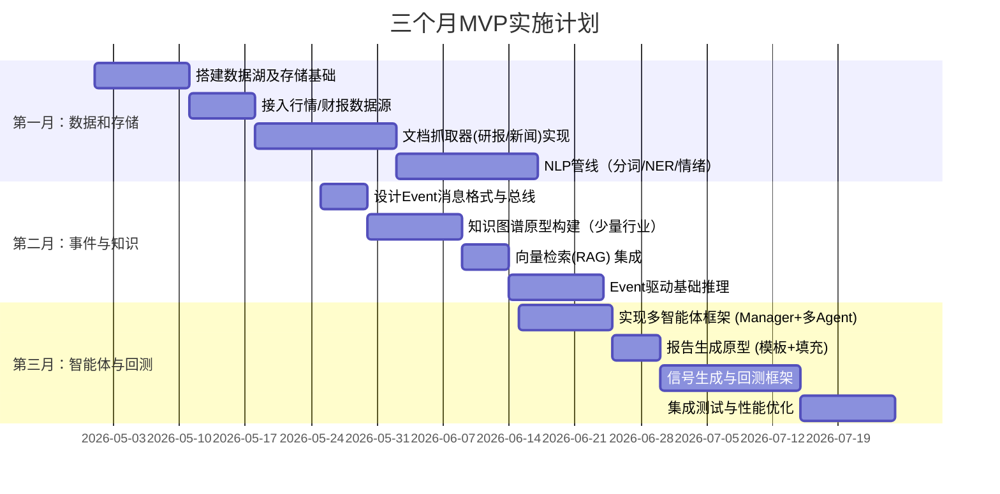

# 执行摘要

构建一个面向**量化研究+行业情报**的企业级系统，需要在现有 LLM-Wiki 基础上，实现“事件驱动、数据湖 + 特征库 + 知识图谱 + 多智能体协同”架构。系统主要目标是输出研究员风格的分析报告（短/中/长期、多场景带概率），并能根据 Word 模板自动生成报告文本，同时产生可回测的多维度 alpha 信号（财务、资金流、量价、估值、股权、产业链、事件、宏观等）。  

简而言之：**数据层（Data Lake）** 负责汇集原始数据（行情、财报、新闻、公告等）；**特征层（Feature Store）** 负责存储清洗后的特征及历史快照（支持时点一致查询）；**知识层** 包含基于文本的知识库/Wiki、向量索引检索(RAG)与产业链图谱；**事件层/EventBus** 负责捕获和分发各类事件（政策、财报、新闻等）；**多智能体分析层** 则由宏观、基本面、技术面、风险、风格(如巴菲特)等专家智能体构成，相互交换信息、共同推理并生成带权重的场景结论；最终**信号层** 将这些结论转化为可回测的交易信号。  

系统采用本地优先（Ollama/GPT-本地、FAISS+向量检索、SQLite/Parquet存储、NetworkX+Neo4j等）与可替换的企业级组件（Milvus、Kafka、Postgres、K8s 等），并支持多用户权限管理和审计。以下内容将逐层详述架构设计、模块接口、时序流程、数据 schema、示例代码和实施路线图。

## 一、总体架构分层

整个系统可分为以下主要层次（见下图）：  

```mermaid
flowchart LR
    subgraph 数据层
        A1[行情/财务原始数据] --> B1[结构化清洗]
        A2[新闻/公告/研报] --> C1[NLP 解析/向量化]
        A3[宏观/指数/资金流] --> B1
        B1 --> D1[历史存储(SQL/Parquet)]
        C1 --> D1
    end
    subgraph 特征层(Feature Store)
        D1 --> E1[特征表/因子库] 
    end
    subgraph 知识层
        F1[行业Wiki/公司画像] 
        F2[RAG 向量检索库]
        F3[产业链知识图谱 (Neo4j/Graph)]
    end
    subgraph 事件层/EventBus
        G1[事件总线 (Kafka/RabbitMQ)]
    end
    subgraph 多Agent分析
        H1[宏观Agent] --> I1[Manager协调]
        H2[基本面Agent] --> I1
        H3[技术面Agent] --> I1
        H4[风险Agent] --> I1
        H5[风格(Buffett)Agent] --> I1
        I1 --> J1[综合分析决策]
    end
    subgraph 信号层/报告
        J1 --> K1[交易信号 & 报告生成]
    end

    %% 连线
    D1 --> G1
    G1 --> F1
    G1 --> H1
    G1 --> H2
    G1 --> H3
    G1 --> H4
    G1 --> H5
    F2 --> I1
```  

- **数据层 (Data Lake)**：负责原始数据采集和持久化。包括结构化行情/财务数据和非结构化文档（研报、新闻、快讯等）【5†L203-L211】【25†L18-L27】。原始数据以文件/数据库形式存储（可参考数据湖概念），同时将文档经 NLP/Embedding 处理后生成索引和结构化输出。
- **特征层 (Feature Store)**：在数据清洗后，将各类衍生特征（技术指标、资金流因子、情绪分、事件标签等）存入特征库【21†L129-L137】【21†L179-L184】。特征库支持**时点一致查询** (point-in-time)，避免未来数据泄露【21†L129-L137】。例如可用 SQLite/Postgres 存储带时间戳的因子表。
- **知识层**：分为三部分。Wiki/报告库存储行业概览、公司分析等“长期有效”的结论；向量检索库(Chroma/FAISS)存储文档Embedding，用于 RAG 检索；产业链知识图谱 (Neo4j 或 NetworkX) 存储实体与上下游关系【8†L64-L72】【23†L274-L282】。知识图谱节点包括公司、行业、产品、原材料等，边包括“上游原料→下游产品”、“企业所属行业”等【8†L64-L72】。
- **事件层 (Event Bus)**：所有实时更新、事件触发的数据（如政策公告、财报发布、盈警等）都会封装为事件，经 EventBus 广播。使用 Kafka/Kinesis 之类的消息系统保证可靠分发【14†L89-L97】【14†L182-L189】。事件总线充当核心纽带，解耦生产者（数据源/NLP）和消费者（智能体分析模块）。
- **多智能体分析层**：由多个专长不同的智能体(Agents)组成，比如**宏观Agent**(解析利率、通胀影响)、**基本面Agent**(分析财报指标)、**技术面Agent**(识别价格形态)、**资金面Agent**(监测北向资金、融资融券)、**风险Agent**(CVaR、尾部分析)、**风格Agent**(如价值/成长/巴菲特投资风格)等。这些智能体类似投资团队的分析师，通过协调者(Manager)共享上下文【10†L68-L77】【11†L119-L128】，互相提示（如技术分析Agent发现异常波动则提醒新闻Agent）【10†L109-L112】。经过多轮推理，各Agent给出各自的逻辑和观点，最终由协调层整合输出多个备选场景及权重结论【11†L119-L128】【12†L31-L39】。
- **信号/报告层**：汇总分析结果，输出**报告文本**和**可回测信号**。报告可以使用预设Word模板，将智能体给出的观点填入对应段落。信号层将场景结论转换为交易信号，如“某宏观事件发生→做多/做空特定行业或个股”，这些信号可以进回测模块验证【21†L129-L137】【20†L168-L177】。  

## 二、事件总线及接口设计

系统核心采用**事件驱动架构**，各模块通过统一的 EventBus 通信，实现高内聚低耦合【14†L89-L97】【14†L182-L189】。数据层或外部API采集到新信息时发布事件，分析智能体订阅相关主题，触发处理。

- **Event 消息格式**：采用 JSON，例如：
  ```json
  {
    "event_id": "evt_20260506_0001",
    "type": "FinancialReport",
    "symbol": "000858.SZ",
    "timestamp": "2026-05-06T10:00:00Z",
    "publish_time": "2026-05-06T09:30:00Z",
    "payload": {
      "财报类型": "年报",
      "营收同比": 18.5,
      "净利润同比": -5.2,
      "销售毛利率": 39.8
    }
  }
  ```
  - `type`字段定义事件种类（如：MarketData、FinancialReport、PolicyNews、MacroEvent等）。
  - `timestamp`为事件发生时间（如财报公告日），`publish_time`为市场可见时间【14†L159-L164】【18†L77-L83】。
  - **保证时点一致性**：在后续回测时只使用当时已知数据，需记录事件**产生时间**和**系统入库时间**【21†L129-L137】。
- **EventBus**：可选 Kafka、RabbitMQ 等消息队列。所有模块只和 EventBus 接口交互：
  ```python
  class EventBus:
      def publish(topic: str, message: dict): ...
      def subscribe(topic: str, handler: callable): ...
  ```
  生产者（数据采集、NLP解析等）将结构化事件发往某主题；消费者（智能体、特征工程、回测）订阅主题并接收事件进行处理。EventBus 同时记录审计日志和可重放记录以便调试或回测【18†L73-L81】【18†L108-L117】。

## 三、数据湖与特征库设计

### 3.1 数据湖（Data Lake）存储

按照 Lakehouse 思想，将数据分为 Bronze/Silver/Gold 层：

- **Bronze 层（原始层）**：存储未经处理的原始数据。
  - 行情数据：分布式行情抓取后保存为 Parquet 或 SQLite 库（包含 OHLCV、成交量等，按 `symbol`+`timestamp` 索引）。
  - 财务数据：通过 iFinD/Wind API 获取财报、业绩指标，存为结构化表。
  - 研报/新闻/公告：以原始文件（HTML/JSON/PDF）形式存储，并记录元数据（来源、发布时间、抓取时间）。
  - 宏观经济：利率、CPI、汇率等时间序列。
- **Silver 层（清洗层）**：对原始数据做清洗和预处理。
  - 将财务/行情原始数据做缺失处理、单位统一、指数化等，并存入标准化的数据库/Parquet。
  - **NLP解析**：对研报/新闻进行分句、分词、NER、情感分析、事件抽取等，结果写入结构化表（例如 `sentiment`, `entities`, `events` 表）。原文同时生成 Embedding 存入向量库索引，用于 RAG检索【21†L179-L184】【8†L64-L72】。
- **Gold 层（特征层）**：最终决策用的特征/因子。
  - 技术指标：如均线、MACD、RSI 等，以时间戳方式对齐行情数据。
  - 资金流因子：如北向资金净买入、融资融券余额变化等。
  - 估值指标：滚动计算的PE/PB/PS等及其历史分位数。
  - 基本面因子：营收增长率、毛利率、ROE、杠杆比率等。
  - 行业特征：行业景气度、政策强度评分等。
  - **point-in-time** 友好：所有特征均需记录计算时间，并设计 Feature Store 支持按查询时点返回历史特征【21†L129-L137】。

**示例表结构**（以 SQLite 为例）：

| 表名           | 字段（示例）                                                       | 说明             |
|----------------|--------------------------------------------------------------------|------------------|
| market_data    | symbol, date, open, high, low, close, volume                        | 基础行情(分钟/日) |
| financials     | symbol, report_date, revenue, net_profit, eps                        | 财报关键指标     |
| funds_flow     | symbol, date, north_money, margin_balance                            | 资金流向         |
| sentiment      | doc_id, symbol, date, sentiment_score                                | 文本情绪分       |
| events         | event_id, symbol, date, event_type, impact_score                     | NLP抽取的事件    |
| tech_indicators| symbol, date, rsi, macd, sma_short, sma_long                         | 技术指标         |
| risk_metrics   | symbol, date, var_95, beta                                          | 风险相关指标     |
| ...            | ...                                                                | ...              |

数据层采用**统一接口查询**，例如：
```python
features = DataLayer.query(symbol="600519.SH", start="2025-01-01", end="2026-05-01", fields=["close", "rsi", "sentiment_score", "north_money"])
```
让回测层无需关心底层数据来自哪里，只需按需求拉取 DataFrame【21†L129-L137】【20†L168-L177】。

### 3.2 特征库 (Feature Store)

特征库是**离线+在线双存储**的数据平台【21†L53-L61】【21†L129-L137】，支持协同开发和点时查询（training/inference pipelines）。离线端可用列式数据库（Parquet/OLAP），在线端可用时序数据库或缓存表。嵌入式特征（如公司画像）也可存向量数据库。

- **离线存储 (Offline Store)**：所有历史特征汇总，供回测/训练使用。按实体（股票/ETF/指数/Macro）键值组织。
- **在线存储 (Online Store)**：低延迟存取，供线上查询和应用。备份主要特征表。
- **点对点查询 (Point-in-Time Joins)**：Feature Store 应支持按历史时点拉取特征，避免未来数据泄露【21†L129-L137】。例如构造训练集时，自动过滤掉报告发布日期之后的数据。
- **特征发现与再利用**：特征库允许查找和重用已有特征，避免重复计算【21†L129-L137】。

### 3.3 知识图谱

产业链知识图谱存储所有实体（公司、行业、产品、技术等）及其关系【8†L64-L72】【23†L274-L282】，用于因果推理和联想。可用 Neo4j（企业）或 NetworkX/graph-tool（本地）实现，图谱预定义模式包括：

```yaml
# 知识图谱示例架构
nodes:
  - Company {code, name, industry}
  - Industry {code, name, level}
  - Product {id, name, category}
  - Material {id, name}
  - MacroIndicator {name}
edges:
  - (Company)-[BELONGS_TO]->(Industry)
  - (Company)-[PRODUCES]->(Product)
  - (Product)-[USES_MATERIAL]->(Material)
  - (Product)-[CONSUMED_BY]->(Product)
  - (Company)-[COMPETES_WITH]->(Company)
  - (Event)-[AFFECTS]->(Industry/Company)
```

知识图谱用于推理时快速追踪因果链（如石油涨价→燃油成本上涨→航空公司利润受压），并辅助智能体整合信息【8†L64-L72】【8†L134-L141】。

## 四、多智能体协同与决策流程

### 4.1 智能体角色

参考专业投研团队分工【10†L68-L77】【11†L119-L128】，设计以下几类Agent：

- **宏观Agent**：分析宏观指标与地缘政治事件，如利率/通胀政策、国际冲突对市场的潜在影响。
- **基本面Agent**：专注财务报表与估值模型，计算盈利增长、现金流、ROE、负债等核心指标。
- **技术面Agent**：监测价格和成交量模式，计算技术指标(均线、RSI、MACD)，识别支撑阻力。
- **资金面Agent**：跟踪机构资金流动，如北向资金、南向资金、融资融券余额变化等，对情绪动向建模。
- **风险Agent**：进行市场风险评估，如波动率分析、VaR/CVaR、相关性，预警尾部风险。
- **风格Agent**（如“巴菲特Agent”）：根据特定投资风格提出观点，比如价值投资关注低估值高股息，成长投资关注研发投入与未来增长。
- **协调Agent (Manager)**：聚合和分配任务，各Agent共享上下文，并在发现冲突时进行协调【10†L90-L99】【12†L7-L15】。

### 4.2 协作与博弈

各Agent之间通过协调Agent或EventBus交换信息。例如：  

- 技术Agent监测到**大幅震荡**，通过EventBus通知市场情绪（NewsAgent或宏观Agent）寻找触发原因【10†L109-L112】。  
- 基本面Agent发现行业普遍**毛利率下滑**，则宏观Agent检查是否宏观需求不足或成本上升。  
- 风格Agent若察觉某公司估值处历史低位（Buffett投资信号），可增加该公司在讨论中的权重。

最终，协调Agent/决策模块**归纳多个场景**并评估概率。比如针对“美伊冲突”可能有多个结局（和平谈判、区域升级、国际介入等），系统根据当前公开信息和历史模式，让各Agent分别评估风险与机会，然后综合得出每种结局的概率和对应投资策略【10†L109-L112】【11†L119-L128】。

### 4.3 LLM与Prompt示例

每个智能体的逻辑和推理主要由 LLM 驱动。关键步骤包括：事件抽取、文本摘要、因果链推理、观点生成等。示例 Prompt ：

```text
prompt = """
你是一名行业分析师，根据以下新闻内容抽取结构化事件：
"伊朗总统宣布将提高石油出口税，市场对石油供给预期产生动荡。"
请提取：
- 事件类型（政策/宏观/公司决策等）
- 涉及实体（国家、行业、公司）
- 影响方向（正面/负面）
- 发生时间
返回 JSON 结构。
"""
```

或者综合推理：

```text
prompt = """
假设你是投资研究经理。当前有2个情景：
1. 伊朗和美国通过谈判，局势缓和。
2. 没有和解，冲突升级。
请分析每种情景下石油行业和相关股票的价格走势，并给出发生概率。
"""
```

在报告生成时，可以将以上 Agent 得出的观点填入 Word 模板。例如，定义 Word 段落标签：

```yaml
report_template:
  title: "{{topic}} 市场分析报告"
  sections:
    - "宏观环境": "{{macro_summary}}"
    - "行业观点": "{{industry_insight}}"
    - "公司研究": "{{company_analysis}}"
    - "风险提示": "{{risk_warning}}"
```

后端用 Python-Docx 或专用库加载模板，将 `{{...}}` 替换为 `macro_summary`、`industry_insight` 等由智能体生成的文本片段。  

## 五、本地MVP与企业级可替换组件

| 功能模块    | 本地 MVP (轻量)                         | 企业级方案（可替换）          |
|-----------|----------------------------------------|---------------------------|
| LLM       | Ollama/GPT 本地模型；API调用 ChatGPT  | 私有部署 LLM (如内部FinGPT)    |
| 向量索引    | FAISS / Chroma                         | Milvus / Elasticsearch      |
| 图数据库    | NetworkX (内存)                        | Neo4j / TigerGraph         |
| 消息队列    | Python Queue / 简易消息分发             | Kafka / RabbitMQ / Pulsar  |
| 数据库      | SQLite / Parquet（按symbol+date索引）    | PostgreSQL / ClickHouse    |
| 容器化      | 单机 Python 脚本                        | Docker / Kubernetes集群   |
| 身份与权限   | 简单用户表+密码认证                      | OAuth2 + RBAC (Keycloak等)  |
| 监控/审计    | 文件日志 + 简易监控                      | ELK / Splunk / Prometheus  |

**三个月MVP路线：**  



每阶段输出：
1. **第一月**：完成数据层和存储结构（SQLite+文件）；搭建简易数据管道；持久化原始文档和解析结果；确保可查询历史数据。
2. **第二月**：定义并实现事件总线；构建初始知识图谱（先局限一个行业）；搭建向量库（Chroma）检索体系；实现事件触发的因果推理Demo。
3. **第三月**：开发多Agent协同框架及Manager逻辑；实现简单Word报告生成；生成并验证示例信号进行回测；示范将信号与市场数据关联。

**回测示例**：  
假设信号：“若连续3日该股个股研报情绪均为正，并且北向资金净流入超过阈值，则买入”。回测流程要用**时点数据**：每天拉取研报情绪分表与资金流表，与收盘价表 JOIN，然后计算持仓收益。VectorBT 等工具支持直接基于 Pandas 实现矢量化回测【20†L168-L177】。

## 六、安全、权限与审计

- **多用户权限**：采用角色权限控制(RBAC)【16†L48-L57】。系统中定义角色（如“分析师”、“管理者”、“审计员”），并分配权限（读写不同数据表、发布事件、生成信号等）。用户登录后，根据角色进行授权。支持审计日志记录各账号的操作。
- **审计日志**：记录所有关键操作(查询、修改数据、事件发布、报告生成)【18†L73-L81】【18†L108-L117】。每条审计记录包括：**事件**(action)、**行为者**(user)、**时间戳**、**来源IP/工具**、**目标资源**和**结果状态**。审计日志只读不可修改，支持追溯【18†L108-L117】。
- **未来交易接口**：当前系统不直接执行交易，但设计时要预留对接 OMS 的能力。可在信号层输出结构化订单建议，如：
  ```json
  { "symbol": "AGG", "action": "BUY", "quantity": 10000, "price_type": "market", "reason": "预期利率下降带动债市上涨" }
  ```
  将来可通过 FIX 或券商API将这些订单送往交易执行系统。

---

**参考文献：** 数据湖与特征存储的概念可参考 Databricks 等资料【5†L203-L211】【21†L129-L137】；产业链知识图谱建设经验【8†L64-L72】；多智能体金融分析系统设计请参见 FinanceGPT 和 P1GPT 等研究【10†L68-L77】【12†L13-L22】；事件驱动架构在金融系统中的应用【14†L89-L97】【14†L182-L189】；以及审计/RBAC最佳实践【16†L48-L57】【18†L73-L81】。