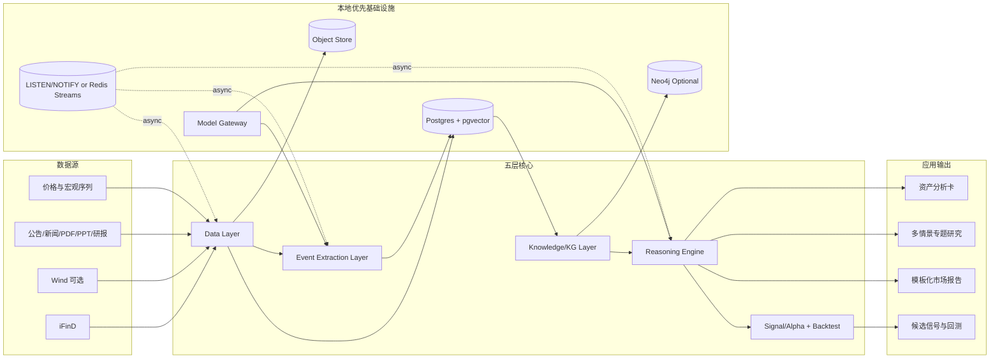
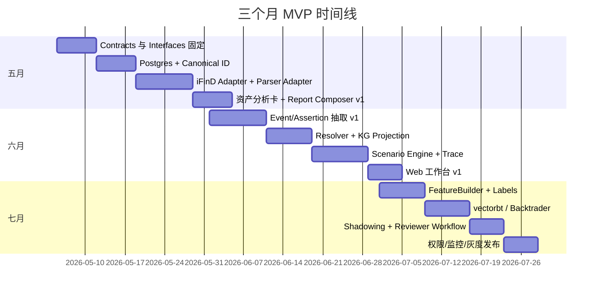

# 从现有 LLM-wiki 与 GBrain 演进到本地优先、可企业化的 AI 产业情报与 Alpha 发现系统

## 执行摘要

这次重构的目标，不应再是“把一个会整理资料的 Wiki 做得更聪明”，而应是把它升级为一个**面向基金研究员工作流**的系统：既能对全球资产做结构化分析，也能对单一主题给出**多情景、带概率、带触发条件**的研究结论，还能把这些结论稳定地填充进模板化市场分析报告，并把其中一部分进一步转化为候选信号与回测对象。你给定的约束——本地优先 MVP、iFinD 已可用、Wind 可选、全球资产覆盖、多用户团队协作、暂不接 OMS 但保留钩子、模型后端既可本地也可通过火山方舟等 API 接入——共同指向了一条很清晰的路线：**高内聚、低耦合的模块化单体（modular monolith）+ 统一数据契约 + 可替换基础设施**。citeturn6search0turn8search4turn6search3turn7search1

从模式层面看，entity["people","Andrej Karpathy","ai researcher"]提出的 LLM Wiki 更适合作为“原始资料不可变、Wiki 由 LLM 持续维护、Schema 约束模型行为”的**人类可读知识投影层**，而不是企业级事实主库；entity["people","Garry Tan","yc ceo"]的 GBrain 则很适合作为“**薄 CLI/MCP 包装 + 可插拔 BrainEngine + 本地到 Postgres 的平滑迁移**”的工程启发，但它面向的是个人 intelligence substrate，不是以产业事件、研究审计、模板写作与 alpha 验证为核心的投研平台。因此，最优解不是在两者之间二选一，而是：**保留它们的优点，重建你的核心真相层**。具体而言，建议以 PostgreSQL + pgvector 作为 canonical fact/event/assertion store，以 LangGraph 作为推理与多情景编排层，以 Report Composer 作为模板写作层，以 vectorbt + Backtrader 作为研究验证与事件驱动仿真层。Karpathy 的 gist 明确把原始资料、Wiki 与 Schema 分成三层；GBrain 官方文档明确把 BrainEngine 作为能力与存储的契约，并提供 PGLite/Postgres 的切换路径；pgvector 官方则强调可以把向量与其他业务数据存储在同一个 Postgres 中，并保留 ACID、JOIN 与 point-in-time recovery 的优势。citeturn0search0turn0search1turn0search5turn0search2turn0search7

面向你的具体岗位与任务，系统的**首要产品形态**应是四个输出：资产分析卡、专题研究备忘录、多情景市场分析报告、候选信号与回测说明，而不是“自动交易”。原因很简单：你现在更迫切的价值在于让系统稳定地产出研究员风格分析，并能按照 Word 模板填充段落；而地缘冲突、政策变化、产业链供需冲击这类问题，本来就不存在单一确定答案，系统应该原生输出多个情景及其概率，而不是把不确定性伪装成一句确定性结论。这个方向与你上传材料所体现的研究范式一致，也与 LangGraph、Haystack、LlamaIndex 这些官方工作流/agent 文档所强调的状态化、多步骤、可插拔编排能力一致。citeturn3search1turn3search6turn1search2turn1search8turn0search7

我的最终建议是：**完全可以重构，不必再把 LLM-wiki 或 GBrain 当成系统中心**；但迁移阶段应通过 adapter 复用你现有的资料解析、索引与知识沉淀资产，避免把三个月 MVP 变成“重写一切”。如果只保留一句架构判断，那就是：**把 Markdown/Wiki 从“真相层”降级为“展示/沉淀层”，把事件、断言、实体、情景、段落、trace、signal 升级为一等对象。** 这样，系统才能真正支持研究、写作、团队协作与后续 alpha 验证。citeturn0search0turn0search1turn0search5turn15search7

## 审计原则与代码库红旗

对 LLM-wiki 的审计，应围绕三个问题：它是否真的实现了“raw sources 不可变、wiki 可重编译、schema 约束行为”的分层；它是否把 wiki 当成**投影层**而不是唯一真相层；它是否在多用户、多环境、多时间点场景下仍然可回放。Karpathy 原始 gist 的价值在于：把原始资料固定为 ground truth，把 Wiki 视为 LLM 可持续维护的“中间表示”，再用 schema 约束 agent 行为。这个模式非常适合单人研究或小规模、慢变化知识库，但官方表述本身也更像“idea file / pattern”而不是现成的企业级平台，所以你不应该把它未经改造地直接扩展到快变化、强审计、强权限的投研系统中。citeturn0search0

对 GBrain 的审计，则应聚焦在它的边界设计是否值得保留。GBrain 官方 ENGINES 文档把 BrainEngine 定义为“what the brain can do”和“how it is stored”之间的契约，并明确说明 PGLiteEngine 是本地零配置默认、PostgresEngine 是远端方案，而且 CLI、MCP、skills 与上层消费者都不需要随着后端切换而重写。这正是你应该学习的工程边界：**统一能力接口、存储后端可替换、调用入口很薄、状态是持久化的一等对象**。但 GBrain 的“compiled truth + timeline”更适合个人 intelligence substrate，不够细化到金融研究需要的 canonical ID、断言来源、审计链与事件时间有效性，因此它只能提供架构灵感，不能直接担任你的事实层。citeturn0search1turn0search5

你当前仓库的审计清单，我建议按下面这张表执行。它不是泛泛的“代码规范建议”，而是为了判断什么能复用、什么必须重构、什么必须在 MVP 第一月就修掉。

| 审计对象 | 必查问题 | 典型红旗 | 整改动作 |
|---|---|---|---|
| 接口边界 | source parser、extractor、retriever、report writer、signal builder 是否通过显式接口交互 | 脚本互相 import 内部函数；插件直接写页面/数据库 | 建 `contracts/`、`interfaces/`、`services/` 包边界 |
| 数据流 | raw → parsed → event/assertion → reasoning → report/signal 是否可追踪 | 原文、摘要、最终结论混在同一 Markdown 中 | 建 immutable raw store + append-only assertion/event log |
| 可扩展性 | 新数据源、新供应商、新模型是否只需加 adapter | provider-specific 逻辑散落到业务层 | 统一 `VendorAdapter` / `ModelGateway` |
| 状态管理 | 审核队列、缓存、作业状态是否是结构化持久对象 | JSON 文件、pickle、隐藏 cache 成为“隐性真相” | 迁到 Postgres 表 + object store |
| 多用户支持 | 团队、项目、模板、缓存是否隔离 | 所有人共享一个 workspace/cache | 引入 `team_id`、`project_id`、RLS |
| 审计与追溯 | 每个结论是否能追到原文、模型版本、prompt 版本、审核人 | 最终答案只有自然语言，没有 trace | 建 `ReasoningTrace`、`SourceRegistry` |
| 供应链安全 | 依赖、许可证、秘密是否被持续检查 | 没有 dependency review、没有 secret scanning | 在 CI 中启用 GitHub Dependency Review 与 Secret Scanning |
| 数据权利 | iFinD/Wind/Choice/研报/PDF 的允许用途是否被登记 | “能抓到就能存、能存就能共享” | 建 rights registry、retention policy |

上表背后的治理依据并不是拍脑袋。GitHub 官方说明，Dependency Review 可以在 PR 阶段识别依赖变化的安全与许可证影响，Secret Scanning 能扫描整个 Git 历史中的密钥泄漏；对于多用户团队系统，这两项应当是默认安全基线。citeturn9search2turn9search6turn10search3turn10search11

许可证与数据权利是另一组高风险红旗。GBrain 是 MIT；LangChain、LangGraph、LlamaIndex 也是 MIT；Haystack、Ray、BentoML 是 Apache-2.0；pgvector 采用 PostgreSQL 风格的宽松许可证；Backtrader 是 GPL-3.0。对 OSS 来说，这意味着大多数组件的二次开发门槛不高，但 Backtrader 若进入对外分发场景需要特别谨慎。对金融数据供应商来说，风险不在于 OSS 许可证，而在于合同：公开页面能证明 entity["company","同花顺","china fintech vendor"] 的数据接口覆盖基础数据、日期序列、高频序列、实时行情、宏观与组合管理，也能证明 entity["company","万得","china financial data"] 和 entity["company","东方财富","china finance portal"] 分别提供全球市场数据/API 与量化接口，但“是否允许团队缓存、模型训练、再分发、长期保留”必须以你们签署的合同为准，而不是以官网营销文案为准。citeturn12search0turn12search1turn12search2turn12search3turn13search0turn13search2turn14search0turn13search3turn14search1turn8search1turn8search4turn6search3turn6search10turn7search1turn7search9

## 目标架构与数据契约

建议架构是**本地优先的模块化单体**，而不是一上来拆成微服务。原因在于：当前你最需要稳定的是数据契约、研究对象、审计链和写作流程，而不是网络边界。官方文档表明，LangGraph 适合需要 durable execution、human-in-the-loop 与 persistence 的长流程推理；pgvector 适合把向量和业务数据放在同一 Postgres 中；FastAPI 与 Pydantic 则天然适合用类型提示和模型定义 API 输入输出。这三者叠起来，刚好形成一个**低耦合、便于后续替换、适合本地起步**的骨架。citeturn0search7turn0search3turn0search2turn15search7turn15search3turn1search0turn1search1



这套架构里的五层，不应只是逻辑划分，而要对应**明确的模块边界、接口与可替换实现**。下面这张表给出建议。

| 层 | 责任边界 | 核心 API | 本地 MVP 技术 | 企业替换路径 | 依据 |
|---|---|---|---|---|---|
| Data | 采集、解析、标准化、幂等入库；不做结论 | `fetch_docs()` `fetch_series()` `normalize()` | Python adapters + Postgres + 本地对象存储 | Airflow/Temporal、对象存储上云 | iFinD/Wind/Choice 官方 API 能力；FastAPI/Pydantic 适合标准化输入输出。 citeturn8search1turn8search4turn6search10turn7search1turn15search7turn1search0 |
| Knowledge/KG | canonical ID、实体、断言、向量索引、图投影、来源与有效期 | `upsert_entity()` `upsert_assertions()` `search()` `materialize_graph()` | Postgres + pgvector；Neo4j 先可选 | 托管 Postgres；Neo4j/Qdrant/OpenSearch | pgvector 主打一库化向量 + 业务数据；Neo4j 适合 property graph。 citeturn0search2turn13search7turn10search2turn10search6 |
| Event Extraction | 文本/表格/图表 → 事件与断言；质量门禁；人工分流 | `extract_events()` `extract_assertions()` `quality_gate()` | Ark/OpenAI-compatible API 或本地模型 + Pydantic | model gateway、并行 worker、HITL 审核台 | 方舟兼容 OpenAI SDK；Pydantic/JSON Schema 适合强约束输出。 citeturn6search0turn1search0turn1search1 |
| Reasoning Engine | 问题分解、证据收集、图遍历、情景生成、模板写作、trace 落地 | `analyze_asset()` `run_scenarios()` `compose_report()` | LangGraph + Python tools | LangSmith/OTel tracing、分布式 worker | LangGraph 强 durable execution/HITL；LlamaIndex/Haystack 也支持 event-driven workflow 与 schema state。 citeturn0search7turn3search1turn3search6turn1search2 |
| Signal/Alpha + Backtest | 特征、标签、评分、候选信号、回测与归因 | `build_features()` `label()` `score_signal()` `backtest()` | vectorbt + Backtrader + Parquet/Postgres | Ray/独立研究集群 | vectorbt 强向量化组合模拟；Backtrader 强事件驱动 broker/strategy 语义。 citeturn9search16turn9search8turn9search9turn9search13 |

真正决定系统是否“高内聚、低耦合”的，是**统一数据契约**。我建议至少把下面这些对象固定成平台宪法。

```python
from datetime import datetime
from typing import Literal, Optional
from pydantic import BaseModel, Field

class CanonicalId(BaseModel):
    canonical_id: str
    asset_type: Literal["equity","etf","future","spot_commodity","fx","index","bond","fund"]
    market: str
    venue: str
    symbol: str
    vendor_ids: dict[str, str] = Field(default_factory=dict)
    name_zh: Optional[str] = None
    name_en: Optional[str] = None

class DocumentEnvelope(BaseModel):
    doc_id: str
    source_type: Literal["policy","news","report","pdf","ppt","filing","vendor_snapshot","internal_note"]
    title: str
    published_at: Optional[datetime] = None
    source_name: str
    language: str = "zh"
    metadata: dict = Field(default_factory=dict)
    raw_text: str
    canonical_text: str

class AssetAnalysisSnapshot(BaseModel):
    canonical_id: str
    as_of: datetime
    financial: dict = Field(default_factory=dict)
    fund_flow: dict = Field(default_factory=dict)
    price_volume: dict = Field(default_factory=dict)
    valuation: dict = Field(default_factory=dict)
    shareholder: dict = Field(default_factory=dict)
    industry: dict = Field(default_factory=dict)
    event_impact: list[str] = Field(default_factory=list)
    macro_exposure: dict = Field(default_factory=dict)
    evidence_refs: list[str] = Field(default_factory=list)
```

```python
class CanonicalEvent(BaseModel):
    event_id: str
    event_type: str
    summary: str
    event_time: Optional[datetime] = None
    impact_direction: Literal["positive","negative","mixed","unknown"]
    confidence: float
    needs_review: bool = True
    entities: list[dict]
    assertions: list[dict]
    evidence_spans: list[dict]
    source_doc_id: str

class ScenarioHypothesis(BaseModel):
    scenario_id: str
    title: str
    horizon: Literal["short","mid","long"]
    probability: float
    assumptions: list[str]
    key_triggers: list[str]
    invalidation_signals: list[str]
    impact_map: dict
    evidence_assertion_ids: list[str]
    confidence: float

class ReasoningTrace(BaseModel):
    trace_id: str
    request_type: str
    question: str
    subject_ids: list[str]
    retrieved_doc_ids: list[str]
    retrieved_assertion_ids: list[str]
    graph_paths: list[dict]
    intermediate_hypotheses: list[dict]
    final_answer: Optional[str] = None
    provider: str
    model_name: str
    prompt_version: str
    total_latency_ms: int
    total_tokens: int
    created_at: datetime
```

因为 Ark 已提供 OpenAI 兼容接口，而 LiteLLM 又提供统一接入 100+ 模型供应商的代理/SDK 模式，所以你的模型后端从 Day 1 就应抽象成 `ModelGateway`，而不是把任何供应商 SDK 直接写进业务层。这样，MVP 可以先接火山方舟，后面再接其他 API 或本地 OpenAI-compatible 模型，而无需重写推理、抽取和报告生成逻辑。citeturn6search0turn7search3turn7search15

## 知识图谱与事件抽取

对于你的场景，知识图谱不应从“画一张产业链图”开始，而应从“**什么是可审计事实**”开始。Neo4j 官方把图数据库定义为由节点、关系和属性组成的 property graph；W3C 的 RDF/PROV 体系则把 provenance 视为关于实体、活动和参与者的结构化信息，named graphs 也天然适合承载多来源快照与 statement scoping。结合这两类模型的优点，我的建议是：**MVP 使用 PostgreSQL + pgvector 作为事实主库与向量层，Neo4j 仅作为图投影层；RDF/PROV 先只借鉴其 provenance 设计思想，不必在三个月 MVP 内强行落地三元组系统。** 这样既能保留 SQL 事务、一库化管理和时间回放能力，又能在需要图遍历或图解释时投影到 Neo4j。citeturn10search2turn10search6turn10search0turn10search1turn10search21turn0search2

### 存储选型比较

| 方案 | 适合的角色 | 优点 | 缺点 | 结论 |
|---|---|---|---|---|
| Postgres + pgvector | canonical fact store + vector search | 事务、一库化、JOIN、PITR、向量与业务数据同库 | 多跳图遍历表达力一般 | **MVP 主库首选** |
| Neo4j | graph projection / explain path | property graph 表达自然，Cypher 适合路径查询 | 不宜同时承担全部事实表与回测表 | **二阶段引入** |
| RDF/Triplestore | ontology/provenance interchange | 语义标准强，named graphs 适合 statement scoping | MVP 成本高，研发复杂度高 | **暂不作为主实现** |

AI compute 示例里，建议把知识图谱中的节点最少分为：Company、Product、Technology、Facility、Segment、Event、Assertion、Source。关系最值钱的并不是数量，而是是否带有时间、来源与置信度。典型关系应包括 `SUPPLIES_TO`、`USES`、`PACKAGES_FOR`、`LOCATED_IN`、`AFFECTS`、`EVIDENCED_BY`、`DERIVED_FROM`。在这个范式下，真正可追溯的是 assertion，而不是 entity 本身。citeturn10search2turn10search6turn9search11

#### AI compute 小型 KG 片段

```text
(Company:HBM_Vendor_A)-[:SUPPLIES_TO]->(Company:Advanced_Packaging_Foundry_B)
(Company:Advanced_Packaging_Foundry_B)-[:PACKAGES_FOR]->(Company:GPU_Designer_C)
(Company:GPU_Designer_C)-[:SELLS_TO]->(Company:Cloud_Operator_D)
(Event:Export_Control_2026Q2)-[:AFFECTS {direction:"negative"}]->(Company:GPU_Designer_C)
(Assertion:packaging_tight_2q)-[:EVIDENCED_BY]->(Source:report_chunk_001)
(ReportSection:cloud_capex_view)-[:DERIVED_FROM]->(Assertion:packaging_tight_2q)
```

#### SQL Schema 示例

```sql
CREATE TABLE entity (
  entity_id        text PRIMARY KEY,
  canonical_id     text UNIQUE NOT NULL,
  entity_type      text NOT NULL,
  canonical_name   text NOT NULL,
  aliases          jsonb NOT NULL DEFAULT '[]'::jsonb,
  vendor_ids       jsonb NOT NULL DEFAULT '{}'::jsonb,
  properties       jsonb NOT NULL DEFAULT '{}'::jsonb,
  created_at       timestamptz NOT NULL DEFAULT now(),
  updated_at       timestamptz NOT NULL DEFAULT now()
);

CREATE TABLE source_document (
  doc_id           text PRIMARY KEY,
  source_type      text NOT NULL,
  title            text,
  published_at     timestamptz,
  source_name      text NOT NULL,
  content_hash     text NOT NULL,
  rights_ref       text,
  parser_version   text NOT NULL,
  object_uri       text NOT NULL,
  metadata         jsonb NOT NULL DEFAULT '{}'::jsonb,
  created_at       timestamptz NOT NULL DEFAULT now()
);

CREATE TABLE assertion (
  assertion_id         text PRIMARY KEY,
  subject_entity_id    text REFERENCES entity(entity_id),
  predicate            text NOT NULL,
  object_entity_id     text,
  object_value         jsonb,
  observed_at          timestamptz,
  valid_from           timestamptz,
  valid_to             timestamptz,
  confidence           numeric NOT NULL,
  source_doc_id        text REFERENCES source_document(doc_id),
  source_span          jsonb NOT NULL,
  extractor_version    text NOT NULL,
  reviewer_status      text NOT NULL DEFAULT 'draft',
  reviewer             text,
  reviewed_at          timestamptz,
  trace_ref            text
);
```

#### Cypher 示例

```cypher
MERGE (c:Company {canonical_id: $company_id})
SET c.name = $company_name, c.updated_at = datetime($updated_at);

MERGE (ev:Event {event_id: $event_id})
SET ev.event_type = $event_type,
    ev.event_time = datetime($event_time),
    ev.summary = $summary,
    ev.confidence = $confidence;

MATCH (target {canonical_id: $target_id})
MERGE (ev)-[:AFFECTS {direction: $direction, magnitude: $magnitude}]->(target);

MATCH p=(ev:Event {event_id: $event_id})-[:AFFECTS]->(mid)
      <-[:SUPPLIES_TO|USES|PACKAGES_FOR*1..2]-(upstream)
RETURN p;
```

实体解析要遵循**确定性优先、语义兜底、人工复核兜底**。顺序建议固定为：vendor code/ticker/ISIN/FIGI/交易所代码 → alias 词典 → embedding 候选召回 → LLM rerank → 人工审核。这一步对你的全球资产覆盖至关重要，因为 A/H/US、商品、FX、ETF、指数之间的命名分歧非常大。iFinD 和 Wind 官方页面都明确强调其全球市场数据/API 覆盖与多资产分析能力，这也是你从第一个版本就必须建立 canonical ID 映射的原因。citeturn8search1turn8search4turn6search3turn6search10

事件抽取层应采用**Schema 约束 + 规则兜底 + 人工分流**的三段式。Pydantic 文档明确说明其模型用于解析和验证结构化输出，JSON Schema 官方则强调它是定义 JSON 结构、约束和数据类型的 declarative language；FastAPI 也直接支持基于 Pydantic 的请求/响应模型与 JSON Schema 扩展。对你来说，这意味着模型输出必须是“待验收的结构化候选”，而不是直接写库的事实。citeturn1search0turn1search1turn15search3turn15search10

#### 事件抽取 Prompt 模板

```text
系统角色：
你是基金研究平台的事件抽取器。你的任务不是写摘要，而是输出“可审计、可回测、可审核”的结构化事件。

输入：
- 文档类型: {{doc_type}}
- 标题: {{title}}
- 发布时间: {{published_at}}
- 来源: {{source_name}}
- 正文:
{{body}}

要求：
1. 只输出符合给定 JSON Schema 的 JSON。
2. 如证据不足，返回 abstain=true，并解释原因。
3. 不得编造实体、数字、日期或结论。
4. 每个事件必须绑定 evidence spans。
5. 对宏观/地缘材料，允许输出多个 scenario seeds，但必须把“现状事实”和“情景推演”分开。
```

#### JSON Schema 示例

```json
{
  "type": "object",
  "required": ["abstain", "events"],
  "properties": {
    "abstain": { "type": "boolean" },
    "abstain_reason": { "type": "string" },
    "events": {
      "type": "array",
      "items": {
        "type": "object",
        "required": [
          "event_type", "summary", "impact_direction",
          "confidence", "needs_review", "entities",
          "assertions", "evidence_spans", "source_doc_id"
        ],
        "properties": {
          "event_type": { "type": "string" },
          "summary": { "type": "string", "maxLength": 500 },
          "impact_direction": {
            "type": "string",
            "enum": ["positive", "negative", "mixed", "unknown"]
          },
          "confidence": { "type": "number", "minimum": 0, "maximum": 1 },
          "needs_review": { "type": "boolean" },
          "source_doc_id": { "type": "string" },
          "entities": { "type": "array" },
          "assertions": { "type": "array" },
          "evidence_spans": { "type": "array" }
        }
      }
    }
  }
}
```

#### 抽取评估指标

| 层级 | 指标 |
|---|---|
| 格式层 | JSON valid rate、schema pass rate、retry rate |
| 识别层 | entity/event/assertion 的 precision、recall、F1 |
| 审核运营层 | reviewer override rate、abstain precision、backlog turnaround |
| 业务层 | 关键事件漏检率、映射错误率、报告可用率 |

规则层必须长期保留，尤其适合你们常见的 PDF/PPT/公告/供应商表格输入：ticker 与交易所代码识别、日期/时间区间正规化、数值与单位抽取、表格标题与字段映射、页眉页脚清洗、研报式标题触发词匹配。这不是“保守做法”，而是让高频、低歧义、结构很强的输入走低成本高置信路径，把 LLM 留给真正需要语义抽象的部分。citeturn1search0turn1search3turn15search6

## 推理引擎、多情景分析与模板写作

你的推理引擎必须把“不确定性”设为第一类对象，而不是设为回答里的附属修辞。像美伊冲突、黄金走势、油价冲击、AI 供需错配这类问题，本来就存在多个可能路径；因此系统应输出 `ScenarioSet`，其中包含多个 `ScenarioHypothesis`、对应概率、关键触发器、失效条件与跨资产影响映射，而不是“一个结论 + 一句风险提示”。LangGraph 官方说明其 runtime 支持 durable execution、human-in-the-loop 和 persistence；LlamaIndex 官方把 workflows 定义为 event-driven、step-based orchestration；Haystack 官方则强调 loop-based tools agent 和 schema-driven state。对你的场景而言，这些能力最适合用于**研究状态机**，而不是单轮聊天。citeturn0search7turn0search3turn3search1turn3search6turn1search2

我建议的推理图结构是：

1. **Task Router**：识别是资产卡、专题研究、市场分析报告还是信号验证；
2. **Evidence Collector**：调度 KG、文档检索、vendor 时间序列；
3. **Hypothesis Builder**：生成 3–4 个情景草案；
4. **Skeptic Node**：寻找反证、过时证据、概率不守恒问题；
5. **Probability Calibrator**：标准化概率并做总和检查；
6. **Report Composer**：按模板生成段落；
7. **Trace Writer**：写入推理痕迹、引用、模型信息。

这种结构的优点，是把“证据检索”“结论生成”“反证审查”“落地写作”解耦，让每一层都可替换、可评估、可回放。citeturn0search7turn1search8turn3search9

### 情景推理数据契约

```python
class ScenarioHypothesis(BaseModel):
    scenario_id: str
    title: str
    horizon: Literal["short", "mid", "long"]
    probability: float
    assumptions: list[str]
    key_triggers: list[str]
    invalidation_signals: list[str]
    impact_map: dict
    evidence_assertion_ids: list[str]
    confidence: float

class ScenarioSet(BaseModel):
    set_id: str
    question: str
    hypotheses: list[ScenarioHypothesis]
    normalization_check: bool
    residual_uncertainty: list[str]
```

### 推理提示词模板

```text
你是买方研究团队的情景分析器。请不要输出单一结论。

输入：
- 问题：{{question}}
- 已检索断言：{{assertions_json}}
- 关联图路径：{{graph_paths_json}}
- 市场/宏观/资金数据快照：{{snapshots_json}}

任务：
1. 生成 3-4 个互斥但不必穷尽的情景。
2. 每个情景必须包含：标题、概率、关键假设、触发器、失效条件、跨资产影响。
3. 概率总和必须接近 1；如果不能，请说明原因。
4. 不允许超出证据支持范围的判断。
5. 以 JSON 输出 ScenarioSet。
```

置信度建议拆成两层：**epistemic confidence** 与 **action confidence**。前者回答“证据是否充分”；后者回答“是否足以生成可操作的研究建议或候选信号”。计算时不要只用模型自报分数，而应组合证据覆盖率、来源层级、来源多样性、时间新鲜度、抽取器置信度、图谱一致性、历史相似情境回看结果等因素。这是一个工程规则，不是某个框架自带魔法。citeturn5search17turn5search21turn13search4

真正适合你业务的写作方式，应该是**模板化段落生成**，而不是整篇自由作文。FastAPI 与 Pydantic 官方文档都说明，Pydantic 模型可以附带额外 JSON Schema metadata 与 examples，这很适合作为模板段落的结构化规格；FastAPI 还能天然提供以 Pydantic 模型声明的 API 输入输出。因此，建议把研究员 Word 模板拆成 `SectionSpec` 列表，每段单独生成、单独审核、单独溯源。citeturn15search10turn15search3turn15search7

```python
class SectionSpec(BaseModel):
    key: str
    title: str
    target_words: int
    required_facets: list[str]
    scenario_required: bool = True
    evidence_policy: Literal["strict", "allow_synthesis"] = "strict"

class SectionOutput(BaseModel):
    key: str
    content: str
    evidence_refs: list[str]
    scenario_refs: list[str]
    warnings: list[str] = []
```

### 段落生成模板

```text
你是基金公司研究写作助手。请只生成指定段落，不要生成整篇报告。

段落规格：
{{section_spec_json}}

已知事实：
{{asset_snapshot_json}}

情景集合：
{{scenario_set_json}}

要求：
1. 用买方研究语气，先写结论，再写证据，再写风险。
2. 如果是多情景段落，至少概述主情景和次情景。
3. 不得超出 evidence_refs 支撑范围。
4. 如证据不足，明确写“需进一步跟踪”。
5. 输出 JSON：{key, content, evidence_refs, scenario_refs, warnings}
```

为了让写作、推理、回测真正打通，`ReasoningTrace` 必须持久化到数据库，而不是散落在日志里。OpenTelemetry 官方强调 traces、metrics、logs 的统一语义和 Collector 的集成中转能力；LangGraph 官方也强调状态持久化与恢复。因此，建议每次 `analyze_asset()`、`run_scenarios()`、`compose_report()` 都产出 trace，保存检索到的文档、断言、图路径、模型版本、prompt 版本、token 用量、耗时以及 reviewer 状态，以便后续回放与归因。citeturn5search17turn5search9turn5search13turn0search3

## 信号化、回测与三个月迁移计划

你现在的第一优先级是研究与写作，而不是执行交易，因此 Signalization 必须设计成“**研究验证工具**”，而不是“自动下单器”。建议采用四级漏斗：`observation -> thesis -> scored signal -> trade candidate`。这样一来，系统可以先把研究结论变成结构化 thesis，再通过标签、特征和回测把 thesis 变成 scored signal；最后，如果未来需要接 OMS，只需把 `TradeCandidate` 暴露为外部接口，而不必重写研究内核。citeturn9search0turn9search5

### 特征工程与标签规则

你此前明确提出了八大分析维度：财务、资金、量价、估值、股东、产业、事件、宏观。最好的做法不是让推理层每次临时拼出来，而是把它们做成稳定的特征组，在 `FeatureBuilder` 内统一计算。下面是一份与你需求直接对齐的示例：

| 特征组 | 代表字段 | 粒度 |
|---|---|---|
| 财务 | Revenue YoY/QoQ、净利率、FCF、利息保障倍数 | stock / ETF holdings aggregation |
| 资金 | 北向/南向净流、融资融券余额变化、ETF 份额变化 | stock / ETF / market |
| 量价 | 收益率、波动率、成交额、换手率、事件窗异常收益 | stock / ETF / future |
| 估值 | PE/PB/PS、EV/EBITDA、历史分位 | stock / ETF basket |
| 股东 | 前十大股东集中度、机构持仓变动、股东户数变化 | stock |
| 产业 | 所属行业、上下游位置、政策暴露、进口依赖 | stock / theme |
| 事件 | 公告、并购、监管、出口管制、产能变化 | stock / industry / macro |
| 宏观 | 利率、汇率、通胀、油价、美元指数 beta | cross-asset |

标签建议至少覆盖 1/5/20/60 日四个 horizon，并优先使用**相对收益**而不是绝对涨跌。例如：

- `label_1d = next_1d_return - benchmark_1d_return`
- `label_5d = event_window_5d_alpha`
- `label_20d = medium_trend_alpha`
- `label_60d = thesis_validation_alpha`

对于 ETF，可以对其跟踪指数或同类 ETF 做相对表现；对于商品和外汇，可以对 DXY、曲线或相关 basket 做归一化处理。这样能最大程度地把宏观 beta 与主题/行业 alpha 分离开。这里的关键不是公式复杂，而是让标签定义与研究问题一致。citeturn9search16turn9search8

### Signal-to-trade 映射

```python
class AlphaSignal(BaseModel):
    signal_id: str
    subject_id: str
    horizon: Literal["1d","5d","20d","60d"]
    thesis: str
    score: float
    confidence: float
    scenario_refs: list[str]
    evidence_refs: list[str]
    status: Literal["research_only","candidate","paper_trade"] = "research_only"

class TradeCandidate(BaseModel):
    candidate_id: str
    signal_id: str
    action: Literal["long","short","neutral"]
    sizing_hint: float
    risk_notes: list[str]
```

在回测框架上，我给出非常明确的建议：**vectorbt 用于研究迭代与大规模参数/横截面实验，Backtrader 用于事件驱动语义更强的仿真**。vectorbt 官方强调其面向 portfolio modeling 的向量化与 Numba 编译能力，既支持向量化回测，也支持 event-driven callbacks；Backtrader 官方则强调其以 `Cerebro` 为中心组织 data feeds、strategies、observers、analyzers，并在事件驱动逻辑与 broker 语义上更贴近真实交易流程。citeturn9search16turn9search8turn9search5turn9search9turn9search13turn9search21

研究验证指标建议至少包括：Sharpe、最大回撤、Information Ratio、IC、Rank IC、命中率、分层收益、turnover、情景校准误差和信号半衰期。这里的重点不是“哪个指标最神”，而是你要能回答：**哪些证据组合、哪些情景结构、哪些分析维度，在什么市场 regime 下真正提升了研究结论的可验证性。**

### 测试与 CI/CD

| 测试类型 | 目标 | 样例 |
|---|---|---|
| Unit | parser、resolver、feature builder、labeler | 单函数正确性 |
| Contract | Pydantic / JSON Schema 向后兼容 | `CanonicalEvent`、`ScenarioSet` |
| Golden | 固定报告/PPT/公告抽取回归 | 研究报告黄金集 |
| Retrieval | 检索能否拿回正确信息 | 主题问答证据召回 |
| Reasoning | 情景、概率、触发器是否合理 | 地缘冲突/黄金/AI compute |
| Regression | 更换模型/Prompt 后输出不崩 | section snapshot tests |
| Backtest | 新版特征/标签不破坏旧表现 | 1/5/20/60d 回测基线 |

GitHub 官方的 Dependency Review 与 Secret Scanning 适合直接纳入 CI；FastAPI 官方也建议在迁移 Pydantic 版本时依赖完整测试与 CI 验证。对你这种持续接入模型、数据源与报告模板的系统来说，**contract tests 和 golden tests** 甚至比普通单元测试更重要。citeturn9search2turn9search6turn10search3turn15search2

### 三个月 MVP 实施路线



### 迁移任务与人周估算

| 任务 | 优先级 | 预估人周 |
|---|---:|---:|
| 统一数据契约与接口包 | P0 | 1.0 |
| Postgres + pgvector 基线 | P0 | 1.0 |
| 全球 canonical ID 与 vendor mapping | P0 | 1.5 |
| iFinD Adapter，Wind 占位 Adapter | P0 | 2.0 |
| 文档解析适配层 | P0 | 1.5 |
| AssetAnalysisSnapshot 与资产分析 API | P0 | 1.5 |
| Report Composer v1 | P0 | 2.0 |
| Event/Assertion 抽取 + Quality Gate | P0 | 2.0 |
| 实体解析与 KG 投影 | P1 | 1.5 |
| LangGraph Scenario Engine | P1 | 2.0 |
| Web 工作台 v1 | P1 | 2.5 |
| FeatureBuilder + Labeler | P1 | 2.0 |
| vectorbt / Backtrader 集成 | P1 | 1.5 |
| Shadowing + 审核流 | P1 | 1.0 |
| RLS/Secrets/Registry/OTel | P1 | 1.5 |

月度交付建议很明确：**五月交付分析卡与模板写作骨架，六月交付事件抽取与多情景推理，七月交付信号验证与团队化工作台。** 这条顺序最符合你当前“先研究、先写作、后 signal”的业务优先级。citeturn6search0turn8search1turn15search7

## 运维、合规与框架比较

基础设施的总体原则是：**本地优先，但从第一天就把“替换点”设计好。** 向量层，pgvector 适合做 MVP，因为它允许你把 embedding 与普通关系数据存放在同一个 Postgres，并保留 SQL、事务与备份的一致性；当你后续需要更复杂的 payload filtering、专门化的 vector scaling、或独立向量服务时，可以再切到 entity["company","Qdrant","vector database company"] 这类专用向量库。Qdrant 官方说明其 Cloud 免费层包含 1GB RAM 和 4GB disk，计费按资源使用量增长；这很适合作为未来团队版升级，但并不适合作为你第一天就必须引入的组件。citeturn13search7turn11search0turn11search2turn11search6

流式编排的推荐路径是：**Postgres LISTEN/NOTIFY → Redis Streams → Kafka**。PostgreSQL 官方明确说明 LISTEN/NOTIFY 提供异步通知与可选 payload，非常适合轻量 outbox/worker 触发；entity["company","Redis","in-memory database company"] 官方说明 Streams 是 append-only log，并支持 consumer groups；Apache Kafka 官方则把自己定位为 distributed event streaming platform，适合高性能数据管线与关键业务事件流。因此，MVP 完全可以从 LISTEN/NOTIFY 或 Redis Streams 起步，不必为了“企业感”一开始就上 Kafka。citeturn4search0turn4search3turn4search6turn4search1turn4search7turn4search2turn4search20

监控层建议采用 Prometheus + OpenTelemetry。Prometheus 官方把自己定义为带维度模型和 PromQL 的时序监控系统；OpenTelemetry 官方则强调 traces、metrics、logs 的统一模型，以及 Collector 对数据聚合、转换、脱敏和导出的作用。对你而言，这意味着每个模型调用、检索调用、推理节点、模板段落生成和回测过程都应该落在统一可观测语义下，而不是分散在无结构文本日志里。citeturn5search0turn5search4turn5search17turn5search9turn5search21

在安全与合规上，数据库要做两层事。第一层是权限：PostgreSQL 官方指出，Row-Level Security 允许按用户限制查询、插入、更新和删除的可见行；因此你应该把 `team_id`、`project_id`、`sensitivity_level` 加进核心表，并用 `CREATE POLICY` 管控隔离。第二层是敏感字段保护：PostgreSQL 的 `pgcrypto` 模块可用于对特定字段做加密。配合 GitHub Secret Scanning、Dependency Review 和 source registry，你可以形成一条从代码到数据的最小可用治理链。citeturn5search2turn5search10turn5search3turn5search11turn10search3turn9search2

### 许可证与合同风险矩阵

| 组件/来源 | 许可/权利 | 风险级别 | 建议 |
|---|---|---|---|
| GBrain | MIT | 低 | 可借鉴接口模式；不建议把其 markdown brain 直接当事实层。 citeturn12search0turn12search4 |
| LangChain / LangGraph / LlamaIndex | MIT | 低 | 可作为编排和工具生态，但不要让框架决定域模型。 citeturn12search1turn12search2turn12search3 |
| Haystack / Ray / BentoML | Apache-2.0 | 低 | 许可宽松，主要风险在复杂度而不是许可证。 citeturn13search0turn13search2turn14search0turn14search3 |
| pgvector | PostgreSQL-style permissive | 低 | 适合主库内向量检索。 citeturn13search3turn13search7 |
| Backtrader | GPL-3.0 | 中 | 研究内部使用问题较小；若未来对外分发需单独审查。 citeturn14search1 |
| iFinD / Wind / Choice | 合同约束 | 高 | 公开网站只能证明产品能力，缓存、再分发、训练与共享必须按合同审查。 citeturn8search1turn8search4turn6search3turn6search10turn7search1turn7search9 |

### 粗略成本带

以下数字只能看作**保守估计**，不含任何金融数据合同费用。基于火山方舟官方定价页、后付费 token 说明，以及 Qdrant 官方免费层/按资源计费页面，我建议这样理解成本结构：本地单机 + Ark API 的基础设施成本很低，真正的大头通常是模型 token 与数据合同；当你引入托管向量库或团队多环境部署后，成本才会从低三位数上升到高三位数或低四位数美元/月级别。citeturn6search1turn6search5turn11search0turn11search2

| 场景 | 粗略月成本 | 备注 |
|---|---:|---|
| 本地开发机 + Ark API | 低 | 主要成本是 token；基础设施几乎忽略 |
| 单团队本地/单节点 MVP | 低到中 | Postgres、对象存储、备份、少量监控 |
| 团队单节点部署 + 托管向量层 | 中 | 增加多环境、权限和监控开销 |
| 企业版 | 中到高 | 数据合同、审计、HA、更多模型预算成为主成本 |

### 框架比较与迁移建议

对你来说，真正需要比较的不是“谁最强”，而是“**谁最适合替代哪一层**”。官方文档表明，entity["company","LangChain","agent framework company"] 强在 agent、model/tool integrations；LlamaIndex 强在 over-your-data 的 workflows、agents 与 indexing；Haystack 强在显式 pipeline 与 schema 驱动 agent；Ray Serve 强在多 deployment composition 和从笔记本到集群的平滑扩展；entity["company","BentoML","inference platform company"] 强在生产级 model serving 与 distributed services。就你的路线而言，最优方案不是“全盘迁到某个框架”，而是“保留自研域模型，把最薄弱的编排与服务层交给框架”。citeturn8search2turn8search5turn8search8turn0search7turn3search9turn3search6turn1search11turn1search2turn2search4turn2search0turn2search3turn2search11

| 方案 | 最适合替代的层 | 优点 | 主要风险 | 迁移成本 |
|---|---|---|---|---:|
| Karpathy LLM-wiki 模式 | 人类可读知识投影层 | 适合 compiled notes、知识沉淀 | 不适合事实主库与多用户审计 | 1–2 人周 |
| GBrain 模式 | engine abstraction / local-first substrate | BrainEngine 边界清楚，本地到 Postgres 平滑 | 个人 brain 偏强，不是投研域模型 | 2–4 人周 |
| LangChain | 工具调用与轻量 agent | 集成多、上手快 | 容易把业务边界交给框架 | 2–3 人周 |
| LangGraph | 推理编排主骨架 | durable execution、HITL、persistence | 需要自己设计状态机 | 3–5 人周 |
| LlamaIndex | 数据到 agent / 文档接入与 structured output | over-your-data 经验成熟 | 容易与自建 data plane 重叠 | 2–4 人周 |
| Haystack | deterministic pipeline / agent state | 显式组件图、透明、可测试性好 | 生态声量略小于 LangChain 栈 | 3–5 人周 |
| Ray Serve | 后期服务拆分/高并发推理 | 本地到集群自然、deployment composition 强 | 对 MVP 过重 | 4–6 人周 |
| BentoML | 模型服务与作业服务 | inference API、batching、distributed services 清晰 | 不解决知识/写作/情景核心问题 | 3–5 人周 |

综合所有维度，我的建议是：**核心业务层坚持自研，Reasoning 用 LangGraph，数据到模型使用 OpenAI-compatible ModelGateway，向量与事实层先用 pgvector，工作台走 FastAPI + Web，回测走 vectorbt + Backtrader，未来若服务化再看 Ray Serve 或 BentoML。** 这条组合既不浪费你现有资产，也不会被任意单一框架绑死。citeturn0search7turn6search0turn0search2turn15search7turn9search16turn9search5turn2search4turn2search3

## 开放问题与限制

这份报告已经尽量以官方/一手文档为依据，但仍有三类限制需要明确说出来。第一，我没有对你的私有代码仓库逐文件做静态分析、调用图分析和测试覆盖率扫描，因此“代码审计”部分是**面向实施的检查清单与红旗清单**，而不是对你当前实现逐文件盖章。第二，iFinD、Wind、Choice 的**再分发、缓存、团队共享、训练用途与数据保留**边界，本质上由你们现有合同决定；公开产品页只能证明产品能力，不能替代法务解释。第三，报告中的成本带是根据官方定价页与平台能力做的粗略推算，**不包含金融数据采购成本**，而在真实基金场景里，这部分往往才是最高成本项。citeturn8search1turn8search4turn6search3turn6search10turn7search1turn7search9turn6search1turn6search5turn11search0

如果按“先把最重要的事情做成”的原则排序，那么下一步不是继续讨论框架，而是立刻落地三件事：**统一 CanonicalId 与核心 Pydantic 契约、打通 iFinD 到 AssetAnalysisSnapshot 的 8 维分析接口、搭出多情景段落生成的 Report Composer v1。** 只要这三件事跑通，你的系统就会从“知识工具”变成“真正开始替研究员产出”的第一代平台。