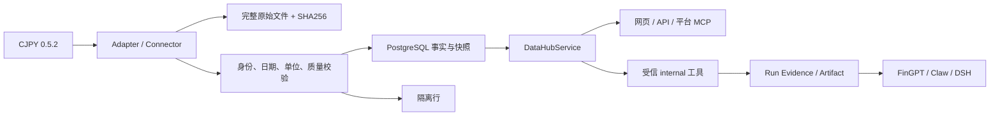

# DataHub：FinGPT / Claw 共用事实服务

本实现从 `codex/merged-platform-v1` 的 `3c42117` 建立独立任务分支。DataHub 的入口为 `/platform/#/capabilities?tab=datahub`，独立页面为 `/datahub`。能力中心 DataHub 页使用真实 API；产品壳其他原型页面的演示内容不代表已接通生产数据。

## 边界与来源



已有 14 个来源注册条目保持不变：CJPY、Wind、AKShare、BaoStock、Yahoo、中证指数、深交所、巨潮、财联社、中国证券网新闻与快讯、知丘研报/公众号/纪要。深交所、巨潮默认禁用；iFinD、本地文件另有适配能力。来源列表的 `unknown` 不代表服务正常，CJPY 健康按钮才执行真实探测。

平台服务负责采集与事实写入；研究层只能通过可信工具读取已校验事实。DSH 不导入 CJPY，也不获取数据库凭据。Claim、Artifact、Note 不回写事实表。

## 安装与迁移

经用户授权，本机 Anaconda 解释器中的 CJPY 已从 0.2.0 升为 0.5.2。业务验证使用同一解释器；分支空 `.venv` 不能证明 SDK 可用。可移植安装命令如下，其他环境安装依赖仍按项目授权规则执行：

```bash
python -m pip install --no-deps vendor/cjpy/cjpy-0.5.2-py3-none-any.whl
```

wheel 为用户提供的 Apache-2.0 包；许可证及 manifest 位于 `vendor/cjpy/`，SHA256 为 `d8c6820a718ae5f79061b54815473dd3ecd3be73cd808634fbac5bc1c385bd94`。`pyproject.toml` 的可选组 `cjpy` 固定 `cjpy==0.5.2`。凭据沿用本机 SDK 配置或 `CJ_KEY`，不进入 API 参数、日志、数据库或仓库。Adapter 使用自己持有的 SDK client，不改全局 token/proxy 环境。

`019_add_datahub.py` 接在 `018` 后，新增 `datahub_snapshot`、`datahub_row`、`datahub_market_bar`、`datahub_run_item` 四张表，不修改 `015–018` 的 20 表基线。按既有 Alembic 配置从 `storage/migrations` 执行增量升级，并将项目根目录加入 `PYTHONPATH`。降级会删除新增四表，应先备份。

## 数据集与参数

| dataset | 内容 | 必要参数 |
|---|---|---|
| universes | 证券板块目录 | 无 |
| code_mappings | 供应商代码映射目录 | 无 |
| market_fields | 行情字段目录 | 无 |
| tables | 通用表目录 | 无 |
| table_fields | 表字段、单位 | table_name |
| factors | 因子目录 | 无 |
| macro_tables | 宏观表目录 | 无 |
| macro_indicators | 宏观指标目录 | 无 |
| codes | 板块证券 | universe；date 可选 |
| stock_list | 股票列表 | date 可选；all 只归档隔离 |
| fund_list | 基金列表 | date 可选 |
| index_constituents | 指数成分 | codes、date |
| trading_days | 交易日 | start_date、end_date |
| daily_quotes | 日线或分钟线 | codes、start_date、end_date |
| factor_data | 因子截面 | codes、factors、date 或 dates |
| table_data | 通用结构化表 | codes、table_name |
| macro_data | 宏观时间序列 | indicator |

代码、字段、日期列表最多 1000 项；日期使用 ISO 格式。行情默认 `cycle=day, rate=前复权`，支持前/后/不复权及 SDK 周期。分钟请求分为最多 31 天一批，日线最多 366 天，因子日期最多 31 天一批；证券按唯一代码拆批。宏观示例 `国内生产总值_本季值@国内生产总值简表` 来自服务端目录，不能猜指标名称。

表与宏观的字段、单位、业务日期从服务端元数据发现；`column_units`、`date_field` 用于人工确认后的明确语义，因子公式可通过 `repo` 提供。公式仅发给已授权 CJPY SDK，不在平台执行任意代码。未知单位、资产身份、日期或异常价格隔离；缺失值保留 null 与 missing_reason，不变成 0。

SH/SZ/BJ/OF 前缀或后缀代码规范化为 `000001.SZ` 等形式。股票/基金专用列表可按明确类型建立有效期身份；类型冲突拒绝，任意板块不推断资产类型。指数成分需先有唯一 `IndexMaster` 和成员身份；缺少主数据时保留原始行并隔离。其他代码命名空间也保留原始结果，需明确身份映射后才能作为事实。

## 存储、时间与重试

原始 gzip JSON 保存所有 SDK 行、列、索引、嵌套字段和所用元数据。SourceRef 使用内容 SHA256，`source_url` 留空，不把 `cjpy://` 写入 HTTP URL 字段。快照按来源、语义查询键、内容哈希幂等；行具有稳定 `snapshot_id:position` 标识。重复同步不重复建事实，已验证行的原始观测信息不改写。隔离行可在身份补齐后的显式重同步中重新校验，原始内容/ID 不变，新的 available_at 和事务事件记录其可用时点。

行情唯一身份为来源、规范证券、上海业务时点、周期、复权方式。默认查询按当前行情投影读取，显式 snapshot_id / fact_id 可读历史。前复权股票日线兼容写入旧 `StockDailyBar`，旧表复权语义未知的记录不会被重写，分钟/其他资产/其他复权不混入该表。因子进入既有 FactorDefinition/FactorValue，公式和单位差异分版本；业务日期统一按上海时区取日。默认因子查询排除已被新值覆盖的指标，历史快照保留原始字段。

全部事实返回业务时点、观测时点、平台可用时点、来源和质量；不能确认历史发布日期时只声明当前平台可用时间。超过 36 小时的业务数据保守标为 stale，目录按最近成功复核时间计算；这不是对各来源更新周期的保证。空页为 unavailable，隔离记录不会经研究工具伪装成 fresh。

手动同步通过 `ScheduledJob` 的 `datahub.ingest` 返回任务 ID。失败批次进入已有租约/续期/重试流程，已完成批次跳过；事务写入前再次核对租约 owner、attempt 和有效期。事实、批次记录与 `datahub.snapshot.updated`/首页失效事件同事务提交。无全市场历史自动回补，不增加 Tick 仓库，也不替换回测系统。

## API、MCP 与研究引用

| 方法与路径（均在 /api/datahub 下） | 用途 |
|---|---|
| GET /sources | 14 个来源注册与 SDK 状态 |
| GET /catalog | 数据集能力；dataset 指定已同步的目录 |
| GET /records | 分页记录、覆盖日期、来源与质量 |
| POST /runs | 手动同步，202 + ScheduledJob；重复 body idempotency_key 复用任务 |
| GET /runs | 最近同步记录与批次 |
| GET /runs/{job_id} | 单任务状态 |
| POST /sources/cjpy/health | 真实连接检查 |
| POST /research-evidence | 按事实 ID 引用到指定 project/workspace/run |

所有 POST 沿用本地配置 CSRF header；同步参数不接受凭据。事实查询支持 dataset、snapshot_id、fact_id、symbol、起止日期、cycle、adjustment、table_name、indicator、fields、limit（1–1000）和 offset。只有管理 API 可选择 include_quarantined。数据库故障不会被包装成空的正常结果。

`internal:data_catalog`、`internal:data_query` 同时进入封闭安全白名单、可信 registry 和平台执行处理器，保留 `internal:asset_snapshot`。平台 MCP 的 `data_catalog`、`data_query` 调用同一 `DataHubService`；查询工具无写入/同步参数。运行时按完整行限制响应大小并提供 next_offset；单行过大时要求选择更少 fields，不返回截断 JSON。

工具结果作为可信平台 Artifact 和 Evidence 写入原 Run。网页引用也由服务端重新读事实，要求 Run 属于给定项目与 Workspace，遵守既有可补证状态；客户端不能上传替代事实。FinGPT 与 Claw 使用相同查询服务和证据链。此接入不依赖真实 LLM 调用，也不证明外部 DSH 在线。

平台 MCP 启动命令仍为 `python -m mcp.server`。入口显式加载已安装 SDK，解决项目同名 mcp 目录遮蔽 SDK 的问题；使用 SDK 的 initialization options，业务日志写 stderr / logs，stdout 专用于协议。`tests/unit/test_datahub_mcp.py` 通过真实 SDK ClientSession 验证 stdio 握手、目录发现、事实查询与写入拒绝；需环境已安装 SDK 和独立迁移后的测试数据库。此次环境已有 MCP 1.27.2，未安装新包。

## 验证入口与追踪

- `tests/unit/test_datahub.py`：17 数据集完整读回、幂等、原始字段、分钟与复权隔离、身份、单位、缺失、乱序、租约 fencing、部分失败、API、可信工具与证据；设置独立 `DATAHUB_TEST_DATABASE_URL` 后同时运行 PostgreSQL 和 SQLite。
- 架构能力 `CAP-DH-001`，接口 `API-DH-001…008`，服务 `SVC-DH-001`，事实 owner `DATA-DH-001`，事件 `EVT-DH-001`，追踪在合并平台 detailed/catalog 中。
- 实际执行记录见 `.ai/reports/test_report_task-57b4a1d90e32.md`；日志在 `logs/datahub-*.log`。真实样本验证与单元测试分开记录，不把目录容量当成全市场数据库覆盖。
- 原生桌面构建遵守 `docs/desktop_packaging.md`；本机 macOS 结果不代表 Windows 已验证。本任务不发布安装包。
